# ClassifAI


[](#support-level) [](https://github.com/10up/classifai/releases/latest)  [](https://github.com/10up/classifai/blob/develop/LICENSE.md) [](https://playground.wordpress.net/?blueprint-url=https://raw.githubusercontent.com/10up/classifai/develop/.github/blueprints/blueprint.json)

[](https://github.com/10up/classifai/actions/workflows/cypress.yml) [](https://github.com/10up/classifai/actions/workflows/phpunit.yml) [](https://github.com/10up/classifai/actions/workflows/phpcs.yml) [](https://github.com/10up/classifai/actions/workflows/vipcs.yml) [](https://github.com/10up/classifai/actions/workflows/codeql-analysis.yml) [](https://github.com/10up/classifai/actions/workflows/dependency-review.yml)

> Supercharge WordPress Content Workflows and Engagement with Artificial Intelligence.

*You can learn more about ClassifAI's features at [ClassifAIPlugin.com](https://classifaiplugin.com/) and documentation at the [ClassifAI documentation site](https://10up.github.io/classifai/).*

## Overview

Tap into leading cloud-based services like [OpenAI](https://openai.com/), [Microsoft Azure AI](https://azure.microsoft.com/en-us/overview/ai-platform/), [Google Gemini](https://ai.google.dev/) and [IBM Watson](https://www.ibm.com/watson) to augment your WordPress-powered websites.  Publish content faster while improving SEO performance and increasing audience engagement.  ClassifAI integrates Artificial Intelligence and Machine Learning technologies to lighten your workload and eliminate tedious tasks, giving you more time to create original content that matters.

## Features

* Generate a summary of post content and store it as an excerpt using [OpenAI's ChatGPT API](https://platform.openai.com/docs/guides/chat), [Microsoft Azure's OpenAI service](https://azure.microsoft.com/en-us/products/ai-services/openai-service), [Google's Gemini API](https://ai.google.dev/docs/gemini_api_overview), [xAI's Grok](https://x.ai/) or locally using [Ollama](https://ollama.com/)
* Generate key takeaways from post content and render at the top of a post using [OpenAI's ChatGPT API](https://platform.openai.com/docs/guides/chat), [Microsoft Azure's OpenAI service](https://azure.microsoft.com/en-us/products/ai-services/openai-service) or locally using [Ollama](https://ollama.com/)
* Generate titles from post content using [OpenAI's ChatGPT API](https://platform.openai.com/docs/guides/chat), [Microsoft Azure's OpenAI service](https://azure.microsoft.com/en-us/products/ai-services/openai-service), [Google's Gemini API](https://ai.google.dev/docs/gemini_api_overview), [xAI's Grok](https://x.ai/) or locally using [Ollama](https://ollama.com/)
* Expand or condense text content using [OpenAI's ChatGPT API](https://platform.openai.com/docs/guides/chat), [Microsoft Azure's OpenAI service](https://azure.microsoft.com/en-us/products/ai-services/openai-service), [Google's Gemini API](https://ai.google.dev/docs/gemini_api_overview), [xAI's Grok](https://x.ai/) or locally using [Ollama](https://ollama.com/)
* Draft a full length article using [OpenAI's ChatGPT API](https://platform.openai.com/docs/guides/chat), [Microsoft Azure's OpenAI service](https://azure.microsoft.com/en-us/products/ai-services/openai-service) or locally using [Ollama](https://ollama.com/)
* Generate new images on demand to use in-content or as a featured image using [OpenAI's Image Generation API](https://platform.openai.com/docs/guides/images-vision), [Google AI's Imagen API](https://ai.google.dev/gemini-api/docs/image-generation#imagen), [Together AI's API](https://docs.together.ai/docs/images-overview) or locally using [Stable Diffusion](https://github.com/AUTOMATIC1111/stable-diffusion-webui/)
* Generate transcripts of audio files using [OpenAI's Audio Transcription API](https://platform.openai.com/docs/guides/speech-to-text) or [ElevenLabs Speech to Text API](https://elevenlabs.io/docs/capabilities/speech-to-text)
* Moderate incoming comments for sensitive content using [OpenAI's Moderation API](https://platform.openai.com/docs/guides/moderation)
* Convert text content into audio and output a "read-to-me" feature on the front-end to play this audio using [Microsoft Azure's Text to Speech API](https://learn.microsoft.com/en-us/azure/cognitive-services/speech-service/text-to-speech), [Amazon Polly](https://aws.amazon.com/polly/), [OpenAI's Text to Speech API](https://platform.openai.com/docs/guides/text-to-speech) or [ElevenLabs' Text to Speech API](https://elevenlabs.io/docs/capabilities/text-to-speech)
* Classify post content using [IBM Watson's Natural Language Understanding API](https://www.ibm.com/watson/services/natural-language-understanding/), [OpenAI's Embedding API](https://platform.openai.com/docs/guides/embeddings), [Microsoft Azure's OpenAI service](https://azure.microsoft.com/en-us/products/ai-services/openai-service) or locally using [Ollama](https://ollama.com/)
* Create a smart 404 page that has a recommended results section that suggests relevant content to the user based on the page URL they were trying to access using either [OpenAI's Embedding API](https://platform.openai.com/docs/guides/embeddings) or [Microsoft Azure's OpenAI service](https://azure.microsoft.com/en-us/products/ai-services/openai-service) in combination with [ElasticPress](https://github.com/10up/ElasticPress)
* Find similar terms to merge together using either [OpenAI's Embedding API](https://platform.openai.com/docs/guides/embeddings) or [Microsoft Azure's OpenAI service](https://azure.microsoft.com/en-us/products/ai-services/openai-service) in combination with [ElasticPress](https://github.com/10up/ElasticPress). Note this only compares top-level terms and if you merge a term that has children, these become top-level terms as per default WordPress behavior
* Suggest related content based on the currently viewed post using [OpenAI's Embedding API](https://platform.openai.com/docs/guides/embeddings)
* Generate image alt text using [Microsoft Azure's AI Vision API](https://azure.microsoft.com/en-us/services/cognitive-services/computer-vision/), [OpenAI's ChatGPT API](https://platform.openai.com/docs/guides/chat), [xAI's Grok](https://x.ai/) or locally using [Ollama](https://ollama.com/)
* Generate image tags and extract text from images using [Microsoft Azure's AI Vision API](https://azure.microsoft.com/en-us/services/cognitive-services/computer-vision/), [OpenAI's ChatGPT API](https://platform.openai.com/docs/guides/chat) or locally using [Ollama](https://ollama.com/)
* Smartly crop images using [Microsoft Azure's AI Vision API](https://azure.microsoft.com/en-us/services/cognitive-services/computer-vision/)
* Scan PDF files for embedded text and save for use in post meta using [Microsoft Azure's AI Vision API](https://azure.microsoft.com/en-us/services/cognitive-services/computer-vision/)
* Bulk classify content with [WP-CLI](https://wp-cli.org/)
* Modification of your `robots.txt` file to block the most common AI data scraping bots from indexing your site
* Use [built-in filters to override AI credentials](https://10up.github.io/classifai/advanced-docs/programmatic-credentials), allowing management of credentials outside of the database, such as by using environment variables or a specific secret management service

### Language Processing

| Tagging | Recommended Content | Excerpt Generation | Comment Moderation |
| :-: | :-: | :-: | :-: |
| 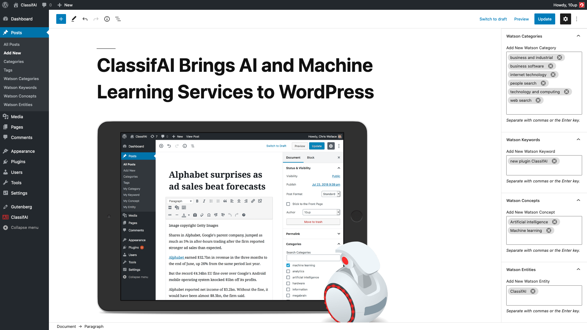 | 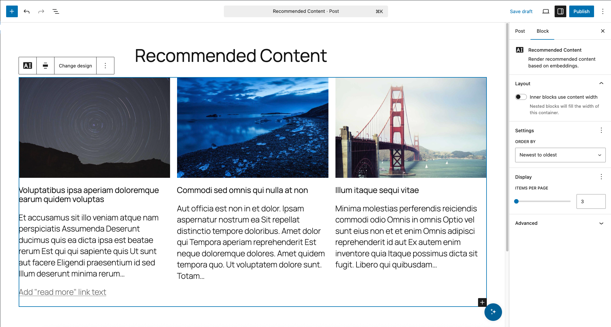 | 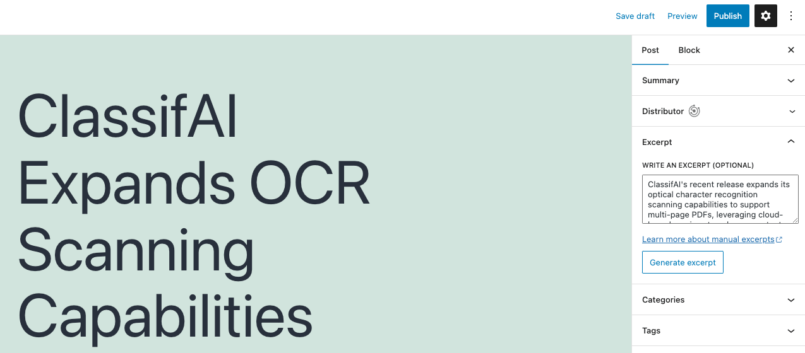 | 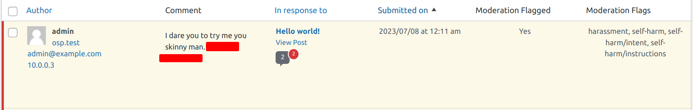 |

| Audio Transcripts | Title Generation | Expand or Condense Text | Text to Speech |
| :-: | :-: | :-: | :-: |
| 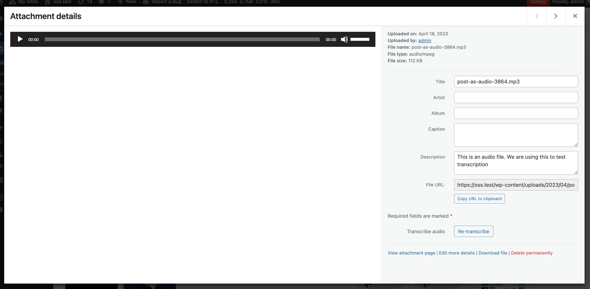 | 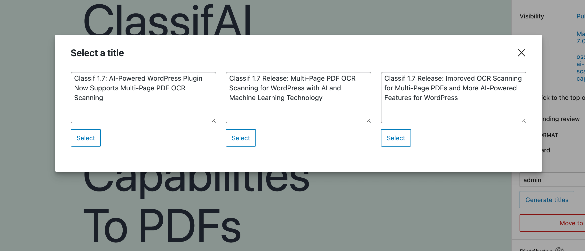 |  | 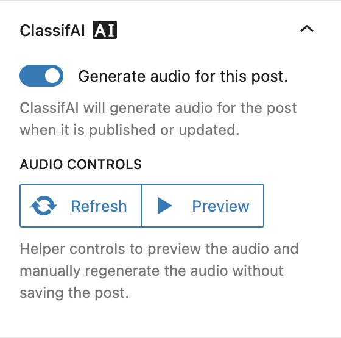 |

| Key Takeaways | Content Generation | | |
| :-: | :-: | :-: | :-: |
| 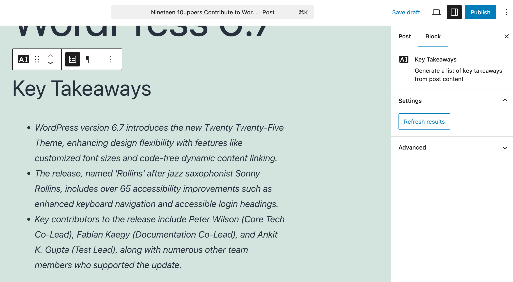 | 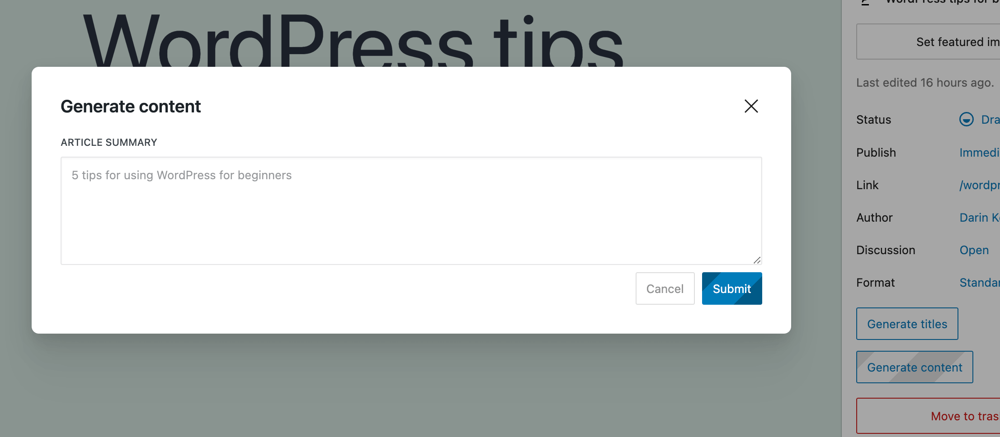 | | |

### Image Processing

| Alt Text | Smart Cropping | Tagging | Generate Images |
| :-: | :-: | :-: | :-: |
| 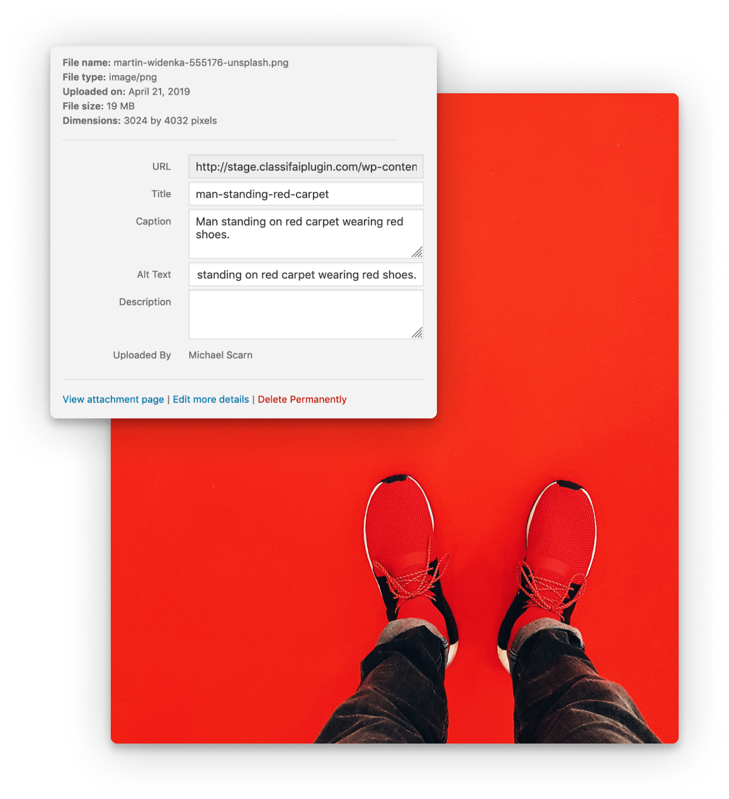 |  | 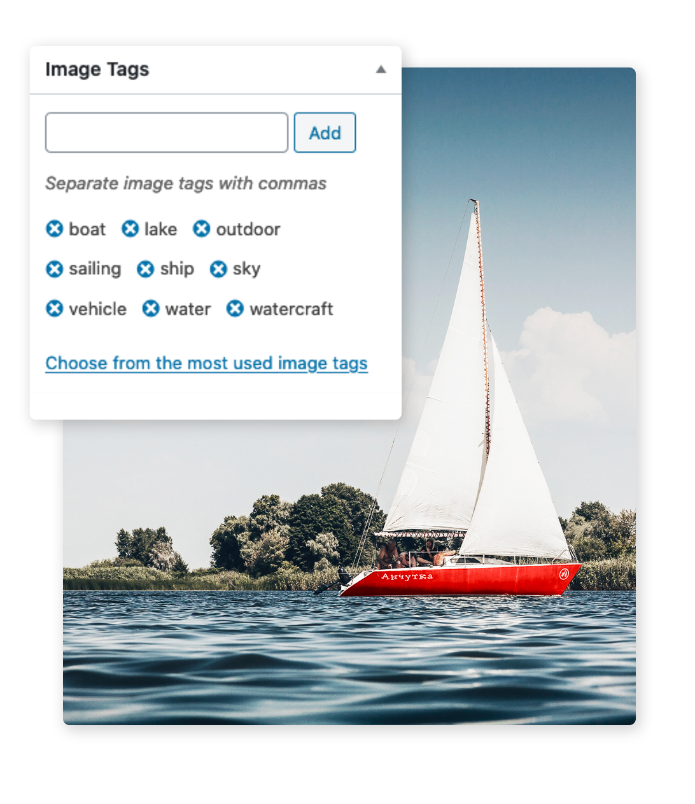 | 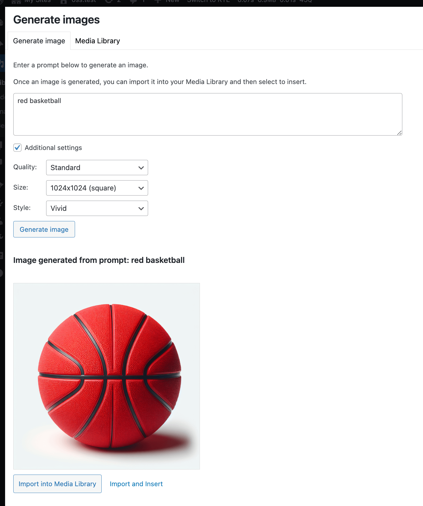 |

## Requirements

* PHP 7.4+
* [WordPress](http://wordpress.org) 6.9+
* Each individual Feature may have its own requirements, please refer to the [ClassifAI documentation site](https://10up.github.io/classifai/get-started/#requirements) for detailed requirements.

## Pricing

Note that there is no cost to using ClassifAI itself. For detailed pricing information, please refer to the [ClassifAI documentation site](https://10up.github.io/classifai/get-started/pricing).

## Installation

Detailed installation instructions can be found on the [ClassifAI documentation site](https://10up.github.io/classifai/get-started/installation).

## Register ClassifAI account

ClassifAI is a sophisticated solution that we want organizations of all shapes and sizes to count on. To keep adopters apprised of major updates and beta testing opportunities, gather feedback, support auto updates, and prioritize common use cases, we're asking for a little bit of information in exchange for a free key. Your information will be kept confidential.

For detailed instructions on how to register for a ClassifAI account, please refer to the [ClassifAI documentation site](https://10up.github.io/classifai/get-started/register-account).

## Set up Features

ClassifAI implements a variety of Features that can be configured and used to augment your WordPress-powered websites. For detailed instructions on how to set up each Feature, please refer to the [ClassifAI documentation site](https://10up.github.io/classifai/feature-configuration).

If you want to more securely manage credentials for a specific Feature, you can use the [built-in filters to override AI credentials](https://10up.github.io/classifai/advanced-docs/programmatic-credentials).

## Run locally hosted LLMs

Some of the Features in ClassifAI can be set up to use locally hosted LLMs. This has the benefit of complete privacy and data control, as well as being able to be run without any cost. The trade-offs here are performance isn't as great and results may also be less accurate.

For full instructions on how to set up locally hosted LLMs, please refer to the [ClassifAI documentation site](https://10up.github.io/classifai/advanced-docs/run-locally-hosted-llms).

## WP CLI Commands

Check out the [ClassifAI docs](https://10up.github.io/classifai/advanced-docs/wp-cli) for instructions on how to use the WP CLI commands.

## Frequently Asked Questions

For a full list of frequently asked questions, please refer to the [ClassifAI documentation site](https://10up.github.io/classifai/get-started/faq).

### Where do I report security bugs found in this plugin?

Please report security bugs found in the source code of the undefined plugin through the [Patchstack Vulnerability Disclosure  Program](https://patchstack.com/database/vdp/f298c330-8d56-4af5-8a69-736281841ce1).  The Patchstack team will assist you with verification, CVE assignment, and notify the developers of this plugin.

## Building and Running Documentation Site

The ClassifAI documentation site is built using [WP Hooks Documentor](https://github.com/10up/wp-hooks-documentor). Follow these steps to build and run the documentation site locally:

### 1. Build Documentation

```bash
# Install dependencies and build the plugin
npm i && npm run build:docs
```

This will:

* Install all required dependencies
* Process all hook documentation from the codebase
* Generate the documentation site in the `./docs` directory

### 2. Run Documentation Site Locally

```bash
# Navigate to docs directory and start the server
cd ./docs && npm run serve
```

The documentation site will be available at [http://localhost:3000](http://localhost:3000).

### 3. Deployment

The documentation site will automatically deploy to GitHub Pages when changes are merged into the `trunk` branch. You can view the live documentation at [https://10up.github.io/classifai/](https://10up.github.io/classifai/).

## Support Level

**Active:** 10up is actively working on this, and we expect to continue work for the foreseeable future including keeping tested up to the most recent version of WordPress.  Bug reports, feature requests, questions, and pull requests are welcome.

## Changelog

A complete listing of all notable changes to ClassifAI are documented in [CHANGELOG.md](https://github.com/10up/classifai/blob/develop/CHANGELOG.md).

## Contributing

Please read [CODE_OF_CONDUCT.md](https://github.com/10up/classifai/blob/develop/CODE_OF_CONDUCT.md) for details on our code of conduct, [CONTRIBUTING.md](https://github.com/10up/classifai/blob/develop/CONTRIBUTING.md) for details on the process for submitting pull requests to us, and [CREDITS.md](https://github.com/10up/classifai/blob/develop/CREDITS.md) for a listing of maintainers, contributors, and libraries for ClassifAI.

## Like what you see?

[](http://10up.com/contact/)
