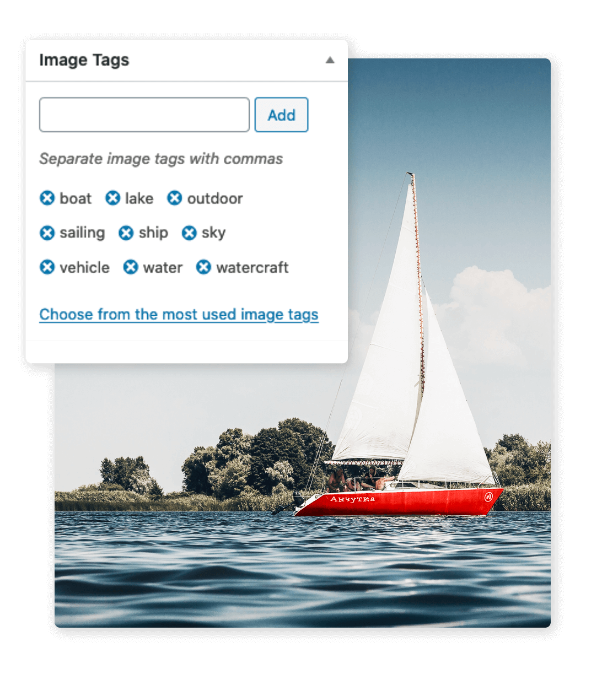
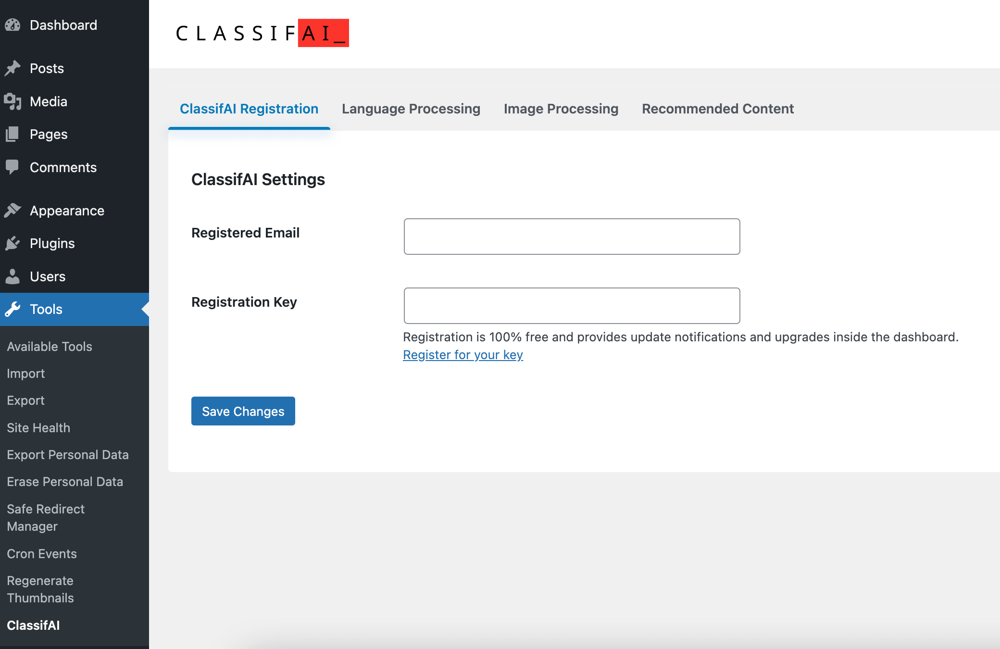

# ClassifAI


[](#support-level) [](https://github.com/10up/classifai/releases/latest)  [](https://github.com/10up/classifai/blob/develop/LICENSE.md) [](https://playground.wordpress.net/?blueprint-url=https://raw.githubusercontent.com/10up/classifai/develop/.github/blueprints/blueprint.json)

[](https://github.com/10up/classifai/actions/workflows/cypress.yml) [](https://github.com/10up/classifai/actions/workflows/test.yml) [](https://github.com/10up/classifai/actions/workflows/lint.yml) [](https://github.com/10up/classifai/actions/workflows/codeql-analysis.yml) [](https://github.com/10up/classifai/actions/workflows/dependency-review.yml)

> Supercharge WordPress Content Workflows and Engagement with Artificial Intelligence.

*You can learn more about ClassifAI's features at [ClassifAIPlugin.com](https://classifaiplugin.com/) and documentation at the [ClassifAI documentation site](https://10up.github.io/classifai/).*

## Overview

Tap into leading cloud-based services like [OpenAI](https://openai.com/), [Microsoft Azure AI](https://azure.microsoft.com/en-us/overview/ai-platform/), [Google Gemini](https://ai.google.dev/) and [IBM Watson](https://www.ibm.com/watson) to augment your WordPress-powered websites.  Publish content faster while improving SEO performance and increasing audience engagement.  ClassifAI integrates Artificial Intelligence and Machine Learning technologies to lighten your workload and eliminate tedious tasks, giving you more time to create original content that matters.

## Features

* Generate a summary of post content and store it as an excerpt using [OpenAI's ChatGPT API](https://platform.openai.com/docs/guides/chat), [Microsoft Azure's OpenAI service](https://azure.microsoft.com/en-us/products/ai-services/openai-service) or [Google's Gemini API](https://ai.google.dev/docs/gemini_api_overview)
* Generate titles from post content using [OpenAI's ChatGPT API](https://platform.openai.com/docs/guides/chat), [Microsoft Azure's OpenAI service](https://azure.microsoft.com/en-us/products/ai-services/openai-service) or [Google's Gemini API](https://ai.google.dev/docs/gemini_api_overview)
* Expand or condense text content using [OpenAI's ChatGPT API](https://platform.openai.com/docs/guides/chat), [Microsoft Azure's OpenAI service](https://azure.microsoft.com/en-us/products/ai-services/openai-service) or [Google's Gemini API](https://ai.google.dev/docs/gemini_api_overview)
* Generate new images on demand to use in-content or as a featured image using [OpenAI's DALL·E 3 API](https://platform.openai.com/docs/guides/images)
* Generate transcripts of audio files using [OpenAI's Whisper API](https://platform.openai.com/docs/guides/speech-to-text)
* Moderate incoming comments for sensitive content using [OpenAI's Moderation API](https://platform.openai.com/docs/guides/moderation)
* Convert text content into audio and output a "read-to-me" feature on the front-end to play this audio using [Microsoft Azure's Text to Speech API](https://learn.microsoft.com/en-us/azure/cognitive-services/speech-service/text-to-speech), [Amazon Polly](https://aws.amazon.com/polly/) or [OpenAI's Text to Speech API](https://platform.openai.com/docs/guides/text-to-speech)
* Classify post content using [IBM Watson's Natural Language Understanding API](https://www.ibm.com/watson/services/natural-language-understanding/), [OpenAI's Embedding API](https://platform.openai.com/docs/guides/embeddings) or [Microsoft Azure's OpenAI service](https://azure.microsoft.com/en-us/products/ai-services/openai-service)
* Create a smart 404 page that has a recommended results section that suggests relevant content to the user based on the page URL they were trying to access using either [OpenAI's Embedding API](https://platform.openai.com/docs/guides/embeddings) or [Microsoft Azure's OpenAI service](https://azure.microsoft.com/en-us/products/ai-services/openai-service) in combination with [ElasticPress](https://github.com/10up/ElasticPress)
* Find similar terms to merge together using either [OpenAI's Embedding API](https://platform.openai.com/docs/guides/embeddings) or [Microsoft Azure's OpenAI service](https://azure.microsoft.com/en-us/products/ai-services/openai-service) in combination with [ElasticPress](https://github.com/10up/ElasticPress). Note this only compares top-level terms and if you merge a term that has children, these become top-level terms as per default WordPress behavior
* BETA: Recommend content based on overall site traffic via [Microsoft Azure's AI Personalizer API](https://azure.microsoft.com/en-us/services/cognitive-services/personalizer/) *(note that this service has been [deprecated by Microsoft](https://learn.microsoft.com/en-us/azure/ai-services/personalizer/) and as such, will no longer work. We are looking to replace this with a new provider to maintain the same functionality (see [issue#392](https://github.com/10up/classifai/issues/392))*
* Generate image alt text, image tags, and smartly crop images using [Microsoft Azure's AI Vision API](https://azure.microsoft.com/en-us/services/cognitive-services/computer-vision/)
* Scan images and PDF files for embedded text and save for use in post meta using [Microsoft Azure's AI Vision API](https://azure.microsoft.com/en-us/services/cognitive-services/computer-vision/)
* Bulk classify content with [WP-CLI](https://wp-cli.org/)

### Language Processing

| Tagging | Recommended Content | Excerpt Generation | Comment Moderation |
| :-: | :-: | :-: | :-: |
|  |  |  |  |

| Audio Transcripts | Title Generation | Expand or Condense Text | Text to Speech |
| :-: | :-: | :-: | :-: |
|  |  |  |  |

### Image Processing

| Alt Text | Smart Cropping | Tagging | Generate Images |
| :-: | :-: | :-: | :-: |
|  |  |  |  |

## Requirements

* PHP 7.4+
* [WordPress](http://wordpress.org) 6.1+
* To utilize the NLU Language Processing functionality, you will need an active [IBM Watson](https://cloud.ibm.com/registration) account.
* To utilize the ChatGPT, Embeddings, Text to Speech or Whisper Language Processing functionality or DALL·E Image Processing functionality, you will need an active [OpenAI](https://platform.openai.com/signup) account.
* To utilize the Azure AI Vision Image Processing functionality or Text to Speech Language Processing functionality, you will need an active [Microsoft Azure](https://signup.azure.com/signup) account.
* To utilize the Azure OpenAI Language Processing functionality, you will need an active [Microsoft Azure](https://signup.azure.com/signup) account and you will need to [apply](https://aka.ms/oai/access) for OpenAI access.
* To utilize the Google Gemini Language Processing functionality, you will need an active [Google Gemini](https://ai.google.dev/tutorials/setup) account.
* To utilize the AWS Language Processing functionality, you will need an active [AWS](https://console.aws.amazon.com/) account.
* To utilize the Smart 404 feature, you will need an active [OpenAI](https://platform.openai.com/signup) account or [Microsoft Azure](https://signup.azure.com/signup) account with OpenAI access and you will need to use [ElasticPress](https://github.com/10up/ElasticPress) 5.0.0+ and [Elasticsearch](https://www.elastic.co/elasticsearch) 7.0+.
* To utilize the Term Cleanup feature, you will need an active [OpenAI](https://platform.openai.com/signup) account or [Microsoft Azure](https://signup.azure.com/signup) account with OpenAI access. For better performance, you will need [ElasticPress](https://github.com/10up/ElasticPress) 5.0.0+ and [Elasticsearch](https://www.elastic.co/elasticsearch) 7.0+.

## Pricing

Note that there is no cost to using ClassifAI itself. Both IBM Watson and Microsoft Azure have free plans for some of their AI services, but above those free plans there are paid levels as well.  So if you expect to process a high volume of content, then you'll want to review the pricing plans for these services to understand if you'll incur any costs.  For the most part, both services' free plans are quite generous and should at least allow for testing ClassifAI to better understand its featureset and could at best allow for totally free usage. OpenAI has a limited trial option that can be used for testing but will require a valid paid plan after that.

IBM Watson's Natural Language Understanding ("NLU"), which is one of the providers that powers the classification feature, has a ["lite" pricing tier](https://www.ibm.com/cloud/watson-natural-language-understanding/pricing) that offers 30,000 free NLU items per month.

OpenAI, which is one of the providers that powers the classification, title generation, excerpt generation, content resizing, audio transcripts generation, text to speech, moderation and image generation features, has a limited free trial and then requires a [pay per usage](https://openai.com/pricing) plan.

Microsoft Azure AI Vision, which is one of the providers that powers the descriptive text generator, image tags generator, image cropping, image text extraction and PDF text extraction features, has a ["free" pricing tier](https://azure.microsoft.com/en-us/pricing/details/cognitive-services/computer-vision/) that offers 20 transactions per minute and 5,000 transactions per month.

Microsoft Azure AI Speech, which is one of the providers that powers the text to speech feature, has a ["free" pricing tier](https://azure.microsoft.com/en-us/pricing/details/cognitive-services/speech-services/) that offers 0.5 million characters per month.

Microsoft Azure AI Personalizer, which is one of the providers that powers the recommended content feature, has a ["free" pricing tier](https://azure.microsoft.com/en-us/pricing/details/cognitive-services/personalizer/) that offers 50,000 transactions per month.

Microsoft Azure OpenAI, which is one of the providers that powers the title generation, excerpt generation and content resizing features, has a [pay per usage](https://azure.microsoft.com/en-us/pricing/details/cognitive-services/openai-service/) plan.

Google Gemini, which is one of the providers that powers the title generation, excerpt generation and content resizing features, has a ["free" pricing tier](https://ai.google.dev/pricing) that offers 60 queries per minute.

## Installation

### Manual Installation

#### 1. Download or Clone this repo, install dependencies and build

- `git clone https://github.com/10up/classifai.git && cd classifai`
- `composer install && npm install && npm run build`

#### 2. Activate Plugin

### Installation via Composer

ClassifAI releases can be installed via Composer.

#### 1. Update composer.json

Instruct Composer to install ClassifAI into the plugins directory by adding or modifying the "extra" section of your project's composer.json file to match the following:

```json
"extra": {
    "installer-paths": {
        "plugins/{$name}": [
            "type:wordpress-plugin"
        ]
    }
}
```

Add this repository to composer.json, specifying a release version, as shown below:

```json
"repositories": [
    {
        "type": "package",
        "package": {
            "name": "10up/classifai",
            "version": "3.1.1",
            "type": "wordpress-plugin",
            "dist": {
                "url": "https://github.com/10up/classifai/archive/refs/tags/3.1.1.zip",
                "type": "zip"
            }
        }
    }
]
```

Finally, require the plugin, using the version number you specified in the previous step:

```json
"require": {
    "10up/classifai": "3.1.1"
}
```

After you run `composer update`, ClassifAI will be installed in the plugins directory with no build steps needed.

#### 2. Activate Plugin

## Register ClassifAI account

ClassifAI is a sophisticated solution that we want organizations of all shapes and sizes to count on. To keep adopters apprised of major updates and beta testing opportunities, gather feedback, support auto updates, and prioritize common use cases, we're asking for a little bit of information in exchange for a free key. Your information will be kept confidential.

### 1. Register for a ClassifAI account

- Register for a free ClassifAI account [here](https://classifaiplugin.com/#cta).
- Check for an email from `ClassifAI Team` which contains the registration key.
- Note that the email will be sent from `opensource@10up.com`, so please whitelist this email address if needed.

### 2. Configure ClassifAI Registration Key under Tools > ClassifAI

- In the `Registered Email` field, enter the email you used for registration.
- In the `Registration Key` field, enter the registration key from the email in step 1 above.



## Set Up Classification (via IBM Watson)

### 1. Sign up for Watson services

- [Register for an IBM Cloud account](https://cloud.ibm.com/registration) or sign into your existing one.
- Check for an email from `IBM Cloud` and click the `Confirm Account` link.
- Log into your account (accepting the privacy policy) and create a new [*Natural Language Understanding*](https://cloud.ibm.com/catalog/services/natural-language-understanding) Resource if you do not already have one. It may take a minute for your account to fully populate with the default resource group to use.
- Click `Manage` in the left hand menu, then `Show credentials` on the Manage page to view the credentials for this resource.

### 2. Configure IBM Watson API Keys under Tools > ClassifAI > Language Processing > Classification

- Select **IBM Watson NLU** in the provider dropdown.

**The credentials screen will show either an API key or a username/password combination.**

#### If your credentials contain an API Key, then:

- In the `API URL` field enter the URL
- Enter your API Key in the `API Key` field.

#### If your credentials contain a username and password, then:

- In the `API URL` field enter the URL
- Enter the `username` value into the `API Username`.
- Enter the `password` into the `API Key` field.

#### ⚠️  Note: Deprecated Endpoint URLs: `watsonplatform.net`

IBM Watson endpoint urls with `watsonplatform.net` were deprecated on 26 May 2021. The pattern for the new endpoint URLs is `api.{location}.{offering}.watson.cloud.ibm.com`. For example, Watson's NLU service offering endpoint will be like: `api.{location}.natural-language-understanding.watson.cloud.ibm.com`

For more information, see https://cloud.ibm.com/docs/watson?topic=watson-endpoint-change.

#### Taxonomy options

IBM Watson's [Categories](https://cloud.ibm.com/docs/natural-language-understanding?topic=natural-language-understanding-about#categories), [Keywords](https://cloud.ibm.com/docs/natural-language-understanding?topic=natural-language-understanding-about#keywords), [Concepts](https://cloud.ibm.com/docs/natural-language-understanding?topic=natural-language-understanding-about#concepts) & [Entities](https://cloud.ibm.com/docs/natural-language-understanding?topic=natural-language-understanding-about#entities) can each be stored in existing WordPress taxonomies or a custom Watson taxonomy.

### 3. Configure Post Types to classify and IBM Watson Features to enable under ClassifAI > Language Processing > Classification

- Choose which public post types to classify when saved.
- Choose whether to assign category, keyword, entity, and concept as well as the thresholds and taxonomies used for each.

### 4. Save a Post/Page/CPT or run WP CLI command to batch classify your content

## Set Up Language Processing Features (via OpenAI ChatGPT)

### 1. Sign up for OpenAI

* [Sign up for an OpenAI account](https://platform.openai.com/signup) or sign into your existing one.
* If creating a new account, complete the verification process (requires confirming your email and phone number).
* Log into your account and go to the [API key page](https://platform.openai.com/account/api-keys).
* Click `Create new secret key` and copy the key that is shown.

### 2. Configure OpenAI API Keys under Tools > ClassifAI > Language Processing > Title Generation, Excerpt Generation or Content Resizing

* Select **OpenAI ChatGPT** in the provider dropdown.
* Enter your API Key copied from the above step into the `API Key` field.

### 3. Enable specific Language Processing feature settings

* For each feature, set any options as needed.
* Save changes and ensure a success message is shown. An error will show if API authentication fails.

### 4. Edit a content type to test enabled features

* To test excerpt generation, edit (or create) an item that supports excerpts. Note: only the block editor is supported.
* Ensure this item has content saved.
* Open the Excerpt panel in the sidebar and click on `Generate Excerpt`.
* To test title generation, edit (or create) an item that supports titles.
* Ensure this item has content saved.
* Open the Summary panel in the sidebar and click on `Generate titles`.
* To test content resizing, edit (or create) an item. Note: only the block editor is supported.
* Add a paragraph block with some content.
* With this block selected, select the AI icon in the toolbar and choose to either expand or condense the text.
* In the modal that pops up, select one of the options.

## Set Up Language Processing Features (via Azure OpenAI)

### 1. Sign up for Azure services

* [Register for a Microsoft Azure account](https://azure.microsoft.com/en-us/free/) or sign into your existing one.
* [Request access](https://aka.ms/oai/access) to Azure OpenAI, if not already granted.
* Log into your account and create a new [*Azure OpenAI resource*](https://learn.microsoft.com/en-us/azure/ai-services/openai/how-to/create-resource) if you do not already have one.
* Copy the name you chose for the deployment when deploying the resource in the previous step.
* Click `Keys and Endpoint` in the left hand Resource Management menu to get the endpoint for this resource.
* Click the copy icon next to `KEY 1` to copy the API Key credential for this resource.

### 2. Configure API Keys under Tools > ClassifAI > Language Processing > Title Generation, Excerpt Generation or Content Resizing

* Select **Azure OpenAI** in the provider dropdown.
* Enter your endpoint you copied from the above step into the `Endpoint URL` field.
* Enter your API Key copied from the above step into the `API key` field.
* Enter your deployment name copied from the above step into the `Deployment name` field.

### 3. Enable specific Language Processing features

* Check the "Enable" checkbox in above screen.
* Set the other options as needed.
* Save changes and ensure a success message is shown. An error will show if API authentication fails.

### 4. Edit a content type to test enabled features

* To test excerpt generation, edit (or create) an item that supports excerpts.
* Ensure this item has content saved.
* Open the Excerpt panel in the sidebar and click on `Generate Excerpt`.
* To test title generation, edit (or create) an item that supports titles.
* Ensure this item has content saved.
* Open the Summary panel in the sidebar and click on `Generate titles`.
* To test content resizing, edit (or create) an item. Note: only the block editor is supported.
* Add a paragraph block with some content.
* With this block selected, select the AI icon in the toolbar and choose to either expand or condense the text.
* In the modal that pops up, select one of the options.

## Set Up Language Processing Features (via Google AI (Gemini API))

### 1. Sign up for Google AI

* [Sign up for a Google account](https://www.google.com/) or sign into your existing one.
* Go to [Google AI Gemini](https://ai.google.dev/) website and click on the Get API key button or go to the [API key page](https://makersuite.google.com/app/apikey) directly.
* Note that if this page doesn't work, it's likely that Gemini is not enabled in your workspace. Contact your workspace administrator to get this enabled.
* Click `Create API key` and copy the key that is shown.

### 2. Configure API Keys under Tools > ClassifAI > Language Processing > Title Generation, Excerpt Generation or Content Resizing

* Select **Google AI (Gemini API)** in the provider dropdown.
* Enter your API Key copied from the above step into the `API Key` field.

### 3. Enable specific Language Processing features

* Check the "Enable" checkbox in above screen.
* Set the other options as needed.
* Save changes and ensure a success message is shown. An error will show if API authentication fails.

### 4. Edit a content type to test enabled features

* To test excerpt generation, edit (or create) an item that supports excerpts.
* Ensure this item has content saved.
* Open the Excerpt panel in the sidebar and click on `Generate Excerpt`.
* To test title generation, edit (or create) an item that supports titles.
* Ensure this item has content saved.
* Open the Summary panel in the sidebar and click on `Generate titles`.
* To test content resizing, edit (or create) an item. Note: only the block editor is supported.
* Add a paragraph block with some content.
* With this block selected, select the AI icon in the toolbar and choose to either expand or condense the text.
* In the modal that pops up, select one of the options.

## Set Up Classification (via OpenAI Embeddings)

### 1. Sign up for OpenAI

* [Sign up for an OpenAI account](https://platform.openai.com/signup) or sign into your existing one.
* If creating a new account, complete the verification process (requires confirming your email and phone number).
* Log into your account and go to the [API key page](https://platform.openai.com/account/api-keys).
* Click `Create new secret key` and copy the key that is shown.

### 2. Configure OpenAI API Keys under Tools > ClassifAI > Language Processing > Classification

* Select **OpenAI Embeddings** in the provider dropdown.
* Enter your API Key copied from the above step into the `API Key` field.

### 3. Enable specific Language Processing features

* Choose to automatically classify content.
* Set the other options as needed.
* Save changes and ensure a success message is shown. An error will show if API authentication fails.

### 4. Edit a content item

* Create one or more terms within the taxonomy (or taxonomies) chosen in settings.
* Create a new piece of content that matches the post type and post status chosen in settings.
* Open the taxonomy panel in the sidebar and see terms that were auto-applied.

## Set Up Audio Transcripts Generation (via OpenAI Whisper)

Note that [OpenAI](https://platform.openai.com/docs/guides/speech-to-text) can create a transcript for audio files that meet the following requirements:

* The file must be presented in mp3, mp4, mpeg, mpga, m4a, wav, or webm format
* The file size must be less than 25 megabytes (MB)

### 1. Sign up for OpenAI

* [Sign up for an OpenAI account](https://platform.openai.com/signup) or sign into your existing one.
* If creating a new account, complete the verification process (requires confirming your email and phone number).
* Log into your account and go to the [API key page](https://platform.openai.com/account/api-keys).
* Click `Create new secret key` and copy the key that is shown.

### 2. Configure OpenAI API Keys under Tools > ClassifAI > Language Processing > Audio Transcripts Generation

* Select **OpenAI Embeddings** in the provider dropdown.
* Enter your API Key copied from the above step into the `API Key` field.

### 3. Enable specific features

* Choose to enable the ability to automatically generate transcripts from supported audio files.
* Choose which user roles have access to this ability.
* Save changes and ensure a success message is shown. An error will show if API authentication fails.

### 4. Upload a new audio file

* Upload a new audio file.
* Check to make sure the transcript was stored in the Description field.

## Set Up Text to Speech (via Microsoft Azure)

### 1. Sign up for Azure services

* [Register for a Microsoft Azure account](https://azure.microsoft.com/en-us/free/) or sign into your existing one.
* Log into your account and create a new [*Speech Service*](https://portal.azure.com/#view/Microsoft_Azure_ProjectOxford/CognitiveServicesHub/~/overview) if you do not already have one.  It may take a minute for your account to fully populate with the default resource group to use.
* Click `Keys and Endpoint` in the left hand Resource Management menu to view the `Location/Region` for this resource.
* Click the copy icon next to `KEY 1` to copy the API Key credential for this resource.

### 2. Configure Microsoft Azure API and Key under Tools > ClassifAI > Language Processing > Text to Speech

* Select **Microsoft Azure AI Speech** in the provider dropdown.
* In the `Endpoint URL` field, enter the following URL, replacing `LOCATION` with the `Location/Region` you found above: `https://LOCATION.tts.speech.microsoft.com/`.
* In the `API Key` field, enter your `KEY 1` copied from above.
* Click **Save Changes** (the page will reload).
* If connected successfully, a new dropdown with the label "Voices" will be displayed.
* Select a voice as per your choice.
* Select a post type that should use this service.

### 3. Using the Text to Speech service

* Assuming the post type selected is "post", create a new post and publish it.
* After a few seconds, a "Preview" button will appear under the ClassifAI settings panel.
* Click the button to preview the generated speech audio for the post.
* View the post on the front-end and see a read-to-me feature has been added

## Set Up Text to Speech (via OpenAI)

### 1. Sign up for OpenAI

* [Sign up for an OpenAI account](https://platform.openai.com/signup) or sign into your existing one.
* If creating a new account, complete the verification process (requires confirming your email and phone number).
* Log into your account and go to the [API key page](https://platform.openai.com/account/api-keys).
* Click `Create new secret key` and copy the key that is shown.

### 2. Configure OpenAI API Keys under Tools > ClassifAI > Language Processing > Text to Speech

* Select **OpenAI Text to Speech** in the provider dropdown.
* Enter your API Key copied from the above step into the `API Key` field.

### 3. Using the Text to Speech service

* Assuming the post type selected is "post", create a new post and publish it.
* After a few seconds, a "Preview" button will appear under the ClassifAI settings panel.
* Click the button to preview the generated speech audio for the post.
* View the post on the front-end and see a read-to-me feature has been added

## Set Up Text to Speech (via Amazon Polly)

### 1. Sign up for AWS (Amazon Web Services)

* [Register for a AWS account](https://aws.amazon.com/free/) or sign into your existing one.
* Sign in to the AWS Management Console and open the IAM console at [https://console.aws.amazon.com/iam/](https://console.aws.amazon.com/iam/)
* Create IAM User (If you don't have any IAM user)
  * In the navigation pane, choose **Users** and then click **Create user**
  * On the **Specify user details** page, under User details, in User name, enter the name for the new user.
  * Click **Next**
  * On the **Set permissions** page, under Permissions options, select **Attach policies directly**
  * Under **Permissions policies**, search for the policy **polly** and select **AmazonPollyFullAccess** Policy
  * Click **Next**
  * On the **Review and create** page, Review all of the choices you made up to this point. When you are ready to proceed, Click **Create user**.
* In the navigation pane, choose **Users**
* Choose the name of the user for which you want to create access keys, and then choose the **Security credentials** tab.
* In the **Access keys** section, click **Create access key**.
* On the **Access key best practices & alternatives** page, select **Application running outside AWS**
* Click **Next**
* On the **Retrieve access key** page, choose **Show** to reveal the value of your user's secret access key.
* Copy and save the credentials in a secure location on your computer or click "Download .csv file" to save the access key ID and secret access key to a `.csv` file.

### 2. Configure AWS credentials under Tools > ClassifAI > Language Processing > Text to Speech

* Select **Amazon Polly** in the provider dropdown.
* In the `AWS access key` field, enter the `Access key
` copied from above.
* In the `AWS secret access key` field, enter your `Secret access key` copied from above.
* In the `AWS Region` field, enter your AWS region value eg: `us-east-1`
* Click **Save Changes** (the page will reload).
* If connected successfully, a new dropdown with the label "Voices" will be displayed.
* Select a voice and voice engine as per your choice.
* Select a post type that should use this service.

### 3. Using the Text to Speech service

* Assuming the post type selected is "post", create a new post and publish it.
* After a few seconds, a "Preview" button will appear under the ClassifAI settings panel.
* Click the button to preview the generated speech audio for the post.
* View the post on the front-end and see a read-to-me feature has been added

## Set Up the Smart 404 Feature

### 1. Decide on Provider

* This Feature is powered by either OpenAI or Azure OpenAI.
* Once you've chosen a Provider, you'll need to create an account and get authentication details.
  * When setting things up on the Azure side, ensure you choose either the `text-embedding-3-small` or `text-embedding-3-large` model. The Feature will not work with other models.

### 2. Configure Settings under Tools > ClassifAI > Language Processing > Smart 404

* Select the proper Provider in the provider dropdown.
* Enter your authentication details.
* Configure any other settings as desired.

### 3. ElasticPress configuration

Once the Smart 404 Feature is configured, you can then proceed to get ElasticPress set up to index the data.

If on a standard WordPress installation:

* Install and activate the [ElasticPress](https://github.com/10up/elasticpress) plugin.
* Set your Elasticsearch URL in the ElasticPress settings (`ElasticPress > Settings`).
* Go to the `ElasticPress > Sync` settings page and trigger a sync, ensuring this is set to run a sync from scratch. This will send over the new schema to Elasticsearch and index all content, including creating vector embeddings for each post.

If on a WordPress VIP hosted environment:

* [Enable Enterprise Search](https://docs.wpvip.com/enterprise-search/enable/)
* [Run the VIP-CLI `index` command](https://docs.wpvip.com/enterprise-search/index/). This sends the new schema to Elasticsearch and indexes all content, including creating vector embeddings for each post. Note you may need to use the `--setup` flag to ensure the schema is created correctly.

At this point all of your content should be indexed, along with the embeddings data. You'll then need to update your 404 template to display the recommended results.

### 4. Display the recommended results

The Smart 404 Feature comes with a few helper functions that can be used to display the recommended results on your 404 page:

* Directly display the results using the `Classifai\render_smart_404_results()` function.
* Get the data and then display it in your own way using the `Classifai\get_smart_404_results()` function.

You will need to directly integrate these functions into your 404 template where desired. The plugin does not automatically display the results on the 404 page for you.

Both functions support the following arguments. If any argument is not provided, the default value set on the settings page will be used:

* `$index` (string) - The ElasticPress index to search in. Default is `post`.
* `$num` (int) - Maximum number of results to display. Default is `5`.
* `$num_candidates` (int) - Maximum number of results to search over. Default is `5000`.
* `$rescore` (bool) - Whether to run a rescore query or not. Can give better results but often is slower. Default is `false`.
* `$score_function` (string) - The [vector scoring function](https://www.elastic.co/guide/en/elasticsearch/reference/7.17/query-dsl-script-score-query.html#vector-functions) to use. Default is `cosine`. Options are `cosine`, `dot_product`, `l1_norm` and `l2_norm`.

The `Classifai\render_smart_404_results()` function also supports the following additional arguments:

* `$fallback` (bool) - Whether to run a fallback WordPress query if no results are found in Elasticsearch. These results will then be rendered. Default is `true`.

Examples:

```php
// Render the results.
Classifai\render_smart_404_results(
  [
    'index'          => 'post',
    'num'            => 3,
    'num_candidates' => 1000,
    'rescore'        => true,
    'fallback'       => true,
    'score_function' => 'dot_product',
  ]
);
```

```php
// Get the results.
$results = Classifai\get_smart_404_results(
  [
    'index'          => 'post',
    'num'            => 10,
    'num_candidates' => 8000,
    'rescore'        => false,
    'score_function' => 'cosine',
  ]
);

ob_start();

// Render the results.
foreach ( $results as $result ) {
?>
  <div>
    <?php if ( has_post_thumbnail( $result->ID ) ) : ?>
      <figure>
        <a href="<?php echo esc_url( get_permalink( $result->ID ) ); ?>">
          <?php echo wp_kses_post( get_the_post_thumbnail( $result->ID ) ); ?>
        </a>
      </figure>
    <?php endif; ?>
    <a href="<?php echo esc_url( get_permalink( $result->ID ) ); ?>">
      <?php echo esc_html( $result->post_title ); ?>
    </a>
  </div>
<?php
}

$output = ob_get_clean();
echo $output;
```

### Local Quickstart

If you want to quickly test things locally, ensure you have Docker installed (Docker Desktop recommended) and then run the following command:

```bash
docker run -p 9200:9200 -d --name elasticsearch \
  -e "discovery.type=single-node" \
  -e "xpack.security.enabled=false" \
  -e "xpack.security.http.ssl.enabled=false" \
  -e "xpack.license.self_generated.type=basic" \
  docker.elastic.co/elasticsearch/elasticsearch:7.9.0
```

This will download, install and start Elasticsearch v7.9.0 to your local machine. You can then access Elasticsearch at `http://localhost:9200`, which is the same URL you can use to configure ElasticPress with. It is recommended that you change the `Content Items per Index Cycle` setting in ElasticPress to `20` to ensure indexing doesn't timeout. Also be aware of API rate limits on the OpenAI Embeddings API.

## Set Up the Term Cleanup Feature

### 1. Decide on Provider

* This Feature is powered by either OpenAI or Azure OpenAI.
* Once you've chosen a Provider, you'll need to create an account and get authentication details.
  * When setting things up on the Azure side, ensure you choose either the `text-embedding-3-small` or `text-embedding-3-large` model. The Feature will not work with other models.

### 2. Configure Settings under Tools > ClassifAI > Language Processing > Term Cleanup

* Select the proper Provider in the provider dropdown.
* Enter your authentication details.
* Configure any other settings as desired.

### 3. ElasticPress configuration

It is recommended to use ElasticPress with this Feature, especially if processing more than 500 terms, as performance will be significantly better. Once the Term Cleanup Feature is configured, you can then proceed to get ElasticPress set up to index the data.

If on a standard WordPress installation:

* Install and activate the [ElasticPress](https://github.com/10up/elasticpress) plugin.
* Set your Elasticsearch URL in the ElasticPress settings (`ElasticPress > Settings`).
* Enable the [term index](https://www.elasticpress.io/blog/2023/03/enabling-comments-and-terms-in-elasticpress-5-0/) feature.
* Go to the `ElasticPress > Sync` settings page and trigger a sync, ensuring this is set to run a sync from scratch. This will send over the new schema to Elasticsearch and index all content, including creating vector embeddings for each term.

If on a WordPress VIP hosted environment:

* [Enable Enterprise Search](https://docs.wpvip.com/enterprise-search/enable/).
* [Enable the term index](https://docs.wpvip.com/enterprise-search/enable-features/#h-terms). Example command: `vip @example-app.develop -- wp vip-search activate-feature terms`.
* [Run the VIP-CLI `index` command](https://docs.wpvip.com/enterprise-search/index/). This sends the new schema to Elasticsearch and indexes all content, including creating vector embeddings for each term. Note you may need to use the `--setup` flag to ensure the schema is created correctly.

### 4. Start the Term Cleanup Process

Once configured, the plugin will add a new submenu under the Tools menu called Term Cleanup.

* Go to the Term Cleanup page, click on your desired taxonomy, then click on the "Find similar" button.
* This initializes a background process that will compare each term to find ones that are similar.
* Once done, all the results will be displayed.
* You can then skip or merge the potential duplicate terms from the settings page.

## Set Up Image Processing features (via Microsoft Azure)

Note that [Azure AI Vision](https://docs.microsoft.com/en-us/azure/cognitive-services/computer-vision/home#image-requirements) can analyze and crop images that meet the following requirements:
- The image must be presented in JPEG, PNG, GIF, or BMP format
- The file size of the image must be less than 4 megabytes (MB)
- The dimensions of the image must be greater than 50 x 50 pixels
- The file must be externally accessible via URL (i.e. local sites and setups that block direct file access will not work out of the box)

### 1. Sign up for Azure services

- [Register for a Microsoft Azure account](https://azure.microsoft.com/en-us/free/) or sign into your existing one.
- Log into your account and create a new [*Azure AI Vision*](https://portal.azure.com/#blade/Microsoft_Azure_Marketplace/GalleryFeaturedMenuItemBlade/selectedMenuItemId/CognitiveServices_MP/dontDiscardJourney/true/launchingContext/%7B%22source%22%3A%22Resources%20Microsoft.CognitiveServices%2Faccounts%22%7D/resetMenuId/) Service if you do not already have one.  It may take a minute for your account to fully populate with the default resource group to use.
- Click `Keys and Endpoint` in the left hand Resource Management menu to view the `Endpoint` URL for this resource.
- Click the copy icon next to `KEY 1` to copy the API Key credential for this resource.

### 2. Configure Microsoft Azure API and Key under Tools > ClassifAI > Image Processing > Descriptive Text Generator, Image Tags Generator, Image Cropping, Image Text Extraction or PDF Text Extraction

- Select **Microsoft Azure AI Vision** in the provider dropdown.
- In the `Endpoint URL` field, enter your `API endpoint`.
- In the `API Key` field, enter your `KEY 1`.

### 3. Configure specific Image Processing features

- For features that have thresholds or taxonomy settings, set those as needed.
- Image tagging uses Azure's [Describe Image](https://westus.dev.cognitive.microsoft.com/docs/services/5adf991815e1060e6355ad44/operations/56f91f2e778daf14a499e1fe)

### 4. Save Image or PDF file or run WP CLI command to batch classify your content

## Set Up Image Generation (via OpenAI)

### 1. Sign up for OpenAI

* [Sign up for an OpenAI account](https://platform.openai.com/signup) or sign into your existing one.
* If creating a new account, complete the verification process (requires confirming your email and phone number).
* Log into your account and go to the [API key page](https://platform.openai.com/account/api-keys).
* Click `Create new secret key` and copy the key that is shown.

### 2. Configure OpenAI API Keys under Tools > ClassifAI > Image Processing > Image Generation

* Select **OpenAI DALL·E 3** in the provider dropdown.
* Enter your API Key copied from the above step into the `API Key` field.

### 3. Enable specific Image Processing features

* Choose to add the ability to generate images.
* If image generation is configured, set the other options as needed.
* Save changes and ensure a success message is shown. An error will show if API authentication fails.

### 4. Trigger the media flow within a content item

* Create a new content item
* Insert an Image block or choose to add a featured image and choose a new item from the Media Library
* In the media modal that opens, click on the `Generate image` tab
* Enter in a prompt to generate an image
* Once images are generated, choose one or more images to import into your media library
* Choose one image to insert into the content

## Set Up Comment Moderation (via OpenAI Moderation)

### 1. Sign up for OpenAI

* [Sign up for an OpenAI account](https://platform.openai.com/signup) or sign into your existing one.
* If creating a new account, complete the verification process (requires confirming your email and phone number).
* Log into your account and go to the [API key page](https://platform.openai.com/account/api-keys).
* Click `Create new secret key` and copy the key that is shown.

### 2. Configure OpenAI API Keys under Tools > ClassifAI > Language Processing > Moderation

* Select **OpenAI Moderation** in the provider dropdown.
* Enter your API Key copied from the above step into the `API Key` field.

### 3. Enable Comment Moderation

* Select the "Enable" checkbox in above screen.
* Select "Comments" in the "Content to moderate" section.

## Set Up Recommended Content (via Microsoft Azure AI Personalizer)

Azure AI Personalizer has been retired by Microsoft [as of September 2023](https://learn.microsoft.com/en-us/azure/ai-services/personalizer/). The service will continue to work until 2026 but Personalizer resources can no longer be created. As such, consider this provider deprecated and be aware that we will be removing this in the near future. We are hoping to replace with a new provider to maintain the same functionality (see [issue#392](https://github.com/10up/classifai/issues/392)).

Note that [Personalizer](https://azure.microsoft.com/en-us/services/cognitive-services/personalizer/) requires sufficient data volume to enable Personalizer to learn. In general, we recommend a minimum of ~1,000 events per day to ensure Personalizer learns effectively. If Personalizer doesn't receive sufficient data, the service takes longer to determine the best actions.

### 1. Sign up for Azure services

- [Register for a Microsoft Azure account](https://azure.microsoft.com/en-us/free/) or sign into your existing one.
- Log into your account and create a new [Personalizer resource](https://portal.azure.com/#create/Microsoft.CognitiveServicesPersonalizer).
- Enter your service name, select a subscription, location, pricing tier, and resource group.
- Select **Create** to create the resource.
- After your resource has deployed, select the **Go to Resource** button to go to your Personalizer resource.
- Click `Keys and Endpoint` in the left hand Resource Management menu to view the `Endpoint` URL for this resource.
- Click the copy icon next to `KEY 1` to copy the API Key credential for this resource.

For more information, see https://docs.microsoft.com/en-us/azure/cognitive-services/personalizer/how-to-create-resource

### 2. Configure Microsoft Azure API and Key under Tools > ClassifAI > Recommended Content

- In the `Endpoint URL` field, enter your `Endpoint` URL from Step 1 above.
- In the `API Key` field, enter your `KEY 1` from Step 1 above.

### 3. Use "Recommended Content" block to display recommended content on your website

## WP CLI Commands

- Check out the [ClassifAI docs](https://10up.github.io/classifai/).

## Frequently Asked Questions

### What data does ClassifAI gather?

ClassifAI connects your WordPress site directly to your account with specific service provider(s) (e.g. Microsoft Azure AI, IBM Watson, OpenAI), so no data is gathered by 10up.  The data gathered in our [registration form](https://classifaiplugin.com/#cta) is used simply to stay in touch with users so we can provide product updates and news.  More information is available in the [Privacy Policy on ClassifAIplugin.com](https://drive.google.com/open?id=1Hn4XEWmNGqeMzLqnS7Uru2Hl2vJeLc7cI7225ztThgQ).

### What are the Categories, Keywords, Concepts, and Entities within the NLU Language Processing feature?

[Categories](https://cloud.ibm.com/docs/natural-language-understanding?topic=natural-language-understanding-about#categories) are five levels of hierarchies that IBM Watson can identify from your text.  [Keywords](https://cloud.ibm.com/docs/natural-language-understanding?topic=natural-language-understanding-about#keywords) are specific terms from your text that IBM Watson is able to identify.  [Concepts](https://cloud.ibm.com/docs/natural-language-understanding?topic=natural-language-understanding-about#concepts) are high-level concepts that are not necessarily directly referenced in your text.  [Entities](https://cloud.ibm.com/docs/natural-language-understanding?topic=natural-language-understanding-about#entities) are people, companies, locations, and classifications that are made by IBM Watson from your text.

### How can I view the taxonomies that are generated from the NLU classification?

Whatever options you have selected in the Category, Keyword, Entity, and Concept taxonomy dropdowns in the NLU classification settings can be viewed within Classic Editor metaboxes and the Block Editor side panel.  They can also be viewed in the All Posts and All Pages table list views by utilizing the Screen Options to enable those columns if they're not already appearing in your table list view.

### Should I alert my site's users that AI tools are being used?

We recommend that you are transparent with your users that AI tools are being used.  This can be done by adding a notice to your site's Privacy Policy or similar page. Sample copy is provided below:

> This site makes use of Artificial Intelligence tools to help with tasks like language processing, image processing, and content recommendations.

### When a post is sent to OpenAI (e.g. to generate a title or excerpt), is the post content fed into OpenAI and used for other customers?

According to OpenAI, they do not train their models on any data that is sent via API requests (see https://openai.com/enterprise-privacy). OpenAI may keep the data for up to 30 days to identify abuse, though you can request zero data retention (ZDR) with a qualifying use-case.

## Support Level

**Active:** 10up is actively working on this, and we expect to continue work for the foreseeable future including keeping tested up to the most recent version of WordPress.  Bug reports, feature requests, questions, and pull requests are welcome.

## Changelog

A complete listing of all notable changes to ClassifAI are documented in [CHANGELOG.md](https://github.com/10up/classifai/blob/develop/CHANGELOG.md).

## Contributing

Please read [CODE_OF_CONDUCT.md](https://github.com/10up/classifai/blob/develop/CODE_OF_CONDUCT.md) for details on our code of conduct, [CONTRIBUTING.md](https://github.com/10up/classifai/blob/develop/CONTRIBUTING.md) for details on the process for submitting pull requests to us, and [CREDITS.md](https://github.com/10up/classifai/blob/develop/CREDITS.md) for a listing of maintainers, contributors, and libraries for ClassifAI.

## Like what you see?

<a href="http://10up.com/contact/"></a>
