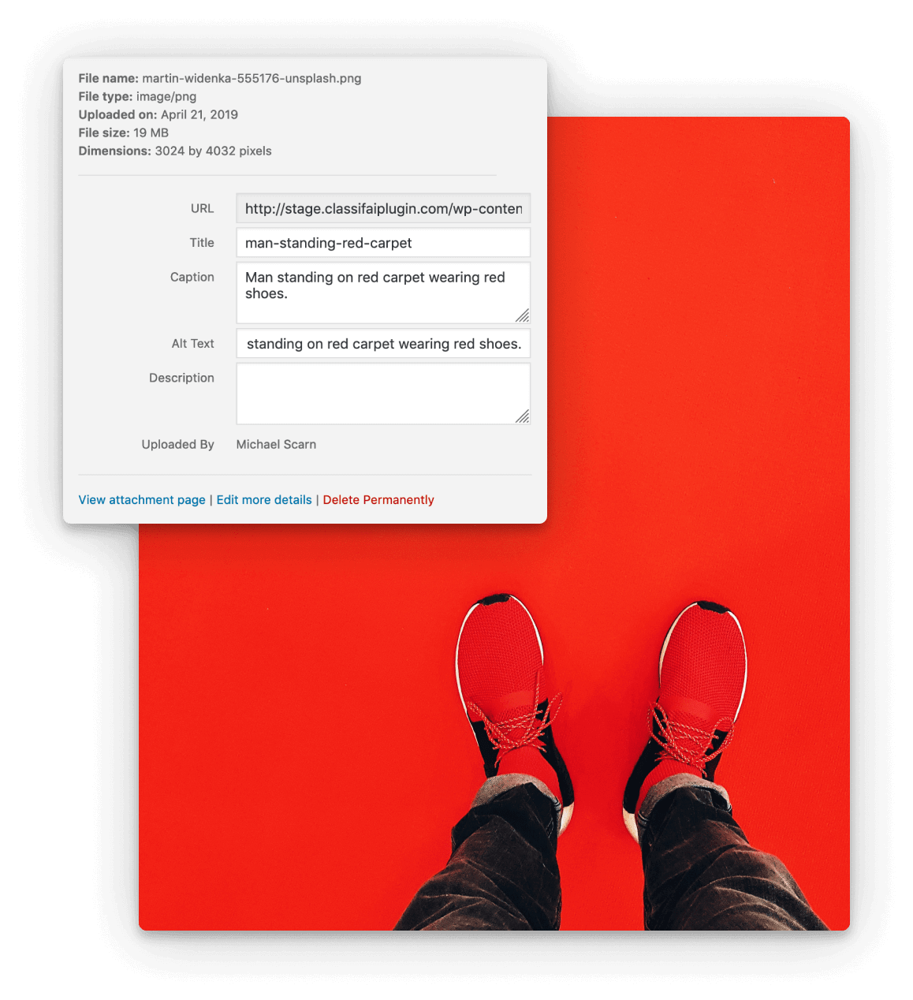

# 

> Supercharge WordPress Content Workflows and Engagement with Artificial Intelligence.

[](#support-level) [](https://github.com/10up/classifai/releases/latest)  [](https://github.com/10up/classifai/blob/develop/LICENSE.md)

[](https://github.com/10up/classifai/actions/workflows/cypress.yml) [](https://github.com/10up/classifai/actions/workflows/test.yml) [](https://github.com/10up/classifai/actions/workflows/lint.yml) [](https://github.com/10up/classifai/actions/workflows/codeql-analysis.yml) [](https://github.com/10up/classifai/actions/workflows/dependency-review.yml)

*You can learn more about ClassifAI's features at [ClassifAIPlugin.com](https://classifaiplugin.com/) and documentation at the [ClassifAI documentation site](https://10up.github.io/classifai/).*

## Table of Contents
* [Overview](#overview)
* [Features](#features)
* [Requirements](#requirements)
* [Pricing](#pricing)
* [Installation](#installation)
* [Register ClassifAI account](#register-classifai-account)
* [Set Up IBM Watson NLU Language Processing](#set-up-language-processing-via-ibm-watson)
* [Set Up OpenAI ChatGPT Language Processing](#set-up-language-processing-via-openai-chatgpt)
* [Set Up OpenAI Embeddings Language Processing](#set-up-language-processing-via-openai-embeddings)
* [Set Up OpenAI Whisper Language Processing](#set-up-language-processing-via-openai-whisper)
* [Set Up Azure AI Language Processing](#set-up-language-processing-via-microsoft-azure)
* [Set Up Azure AI Computer Vision Image Processing](#set-up-image-processing-via-microsoft-azure)
* [Set Up OpenAI DALL·E Image Processing](#set-up-image-processing-via-openai)
* [Set Up Azure Personalizer Recommended Content](#set-up-recommended-content-via-microsoft-azure-personalizer)
* [WP CLI Commands](#wp-cli-commands)
* [FAQs](#frequently-asked-questions)
* [Support](#support-level)
* [Changelog](#changelog)
* [Contributing](#contributing)

## Overview

Tap into leading cloud-based services like [OpenAI](https://openai.com/), [Microsoft Azure AI](https://azure.microsoft.com/en-us/overview/ai-platform/), and [IBM Watson](https://www.ibm.com/watson) to augment your WordPress-powered websites.  Publish content faster while improving SEO performance and increasing audience engagement.  ClassifAI integrates Artificial Intelligence and Machine Learning technologies to lighten your workload and eliminate tedious tasks, giving you more time to create original content that matters.

## Features

* Generate a summary of post content and store it as an excerpt using [OpenAI's ChatGPT API](https://platform.openai.com/docs/guides/chat)
* Generate titles from post content using [OpenAI's ChatGPT API](https://platform.openai.com/docs/guides/chat)
* Generate new images on demand to use in-content or as a featured image using [OpenAI's DALL·E API](https://platform.openai.com/docs/guides/images)
* Generate transcripts of audio files using [OpenAI's Whisper API](https://platform.openai.com/docs/guides/speech-to-text)
* Convert text content into audio and output a "read-to-me" feature on the front-end to play this audio using [Microsoft Azure's Text to Speech API](https://learn.microsoft.com/en-us/azure/cognitive-services/speech-service/text-to-speech)
* Classify post content using [IBM Watson's Natural Language Understanding API](https://www.ibm.com/watson/services/natural-language-understanding/) and [OpenAI's Embedding API](https://platform.openai.com/docs/guides/embeddings)
* BETA: Recommend content based on overall site traffic via [Microsoft Azure's Personalizer API](https://azure.microsoft.com/en-us/services/cognitive-services/personalizer/) _(note that we're gathering feedback on this feature and may significantly iterate depending on community input)_
* Generate image alt text, image tags, and smartly crop images using [Microsoft Azure's Computer Vision API](https://azure.microsoft.com/en-us/services/cognitive-services/computer-vision/)
* Scan images and PDF files for embedded text and save for use in post meta using [Microsoft Azure's Computer Vision API](https://azure.microsoft.com/en-us/services/cognitive-services/computer-vision/)
* Bulk classify content with [WP-CLI](https://wp-cli.org/)

### Language Processing

| Tagging | Recommended Content | Excerpt Generation |
| :-: | :-: | :-: |
|  |  |  |

| Audio Transcripts | Title Generation | Text to Speech |
| :-: | :-: | :-: |
|  |  |  |

### Image Processing

| Alt Text | Smart Cropping | Tagging | Generate Images |
| :-: | :-: | :-: | :-: |
|  |  |  |  |

## Requirements

* PHP 7.4+
* [WordPress](http://wordpress.org) 5.7+
* To utilize the NLU Language Processing functionality, you will need an active [IBM Watson](https://cloud.ibm.com/registration) account.
* To utilize the ChatGPT, Embeddings, or Whisper Language Processing functionality or DALL·E Image Processing functionality, you will need an active [OpenAI](https://platform.openai.com/signup) account.
* To utilize the Computer Vision Image Processing functionality or Text to Speech Language Processing functionality, you will need an active [Microsoft Azure](https://signup.azure.com/signup) account.

## Pricing

Note that there is no cost to using ClassifAI itself. Both IBM Watson and Microsoft Azure have free plans for their AI services, but above those free plans there are paid levels as well.  So if you expect to process a high volume of content, then you'll want to review the pricing plans for these services to understand if you'll incur any costs.  For the most part, both services' free plans are quite generous and should at least allow for testing ClassifAI to better understand its featureset and could at best allow for totally free usage. OpenAI has a limited trial option that can be used for testing but will require a valid paid plan after that.

The service that powers ClassifAI's NLU Language Processing, IBM Watson's Natural Language Understanding ("NLU"), has a ["lite" pricing tier](https://www.ibm.com/cloud/watson-natural-language-understanding/pricing) that offers 30,000 free NLU items per month.

The service that powers ClassifAI's ChatGPT, Embeddings and Whisper Language Processing and DALL·E Image Processing, OpenAI, has a limited free trial and then requires a [pay per usage](https://openai.com/pricing) plan.

The service that powers ClassifAI's Computer Vision Image Processing, Microsoft Azure, has a ["free" pricing tier](https://azure.microsoft.com/en-us/pricing/details/cognitive-services/computer-vision/) that offers 20 transactions per minute and 5,000 transactions per month.

The service that powers ClassifAI's Text to Speech Language Processing, Microsoft Azure, has a ["free" pricing tier](https://azure.microsoft.com/en-us/pricing/details/cognitive-services/speech-services/) that offers 0.5 million characters per month.

The service that powers ClassifAI's Recommended Content, Microsoft Azure's Personalizer, has a ["free" pricing tier](https://azure.microsoft.com/en-us/pricing/details/cognitive-services/personalizer/) that offers 50,000 transactions per month.

## Installation

### Manual Installation

#### 1. Download or Clone this repo, install dependencies and build

- `git clone https://github.com/10up/classifai.git && cd classifai`
- `composer install && npm install && npm run build`

#### 2. Activate Plugin

### Installation via Composer

ClassifAI releases can be installed via Composer.

#### 1. Update composer.json

Instruct Composer to install ClassifAI into the plugins directory by adding or modifying the "extra" section of your project's composer.json file to match the following:

```json
"extra": {
    "installer-paths": {
        "plugins/{$name}": [
            "type:wordpress-plugin"
        ]
    }
}
```

Add this repository to composer.json, specifying a release version, as shown below:

```json
"repositories": [
    {
        "type": "package",
        "package": {
            "name": "10up/classifai",
            "version": "2.0.0",
            "type": "wordpress-plugin",
            "dist": {
                "url": "https://github.com/10up/classifai/archive/refs/tags/2.0.0.zip",
                "type": "zip"
            }
        }
    }
]
```

Finally, require the plugin, using the version number you specified in the previous step:

```json
"require": {
    "10up/classifai": "2.0.0"
}
```

After you run `composer update`, ClassifAI will be installed in the plugins directory with no build steps needed.

#### 2. Activate Plugin

## Register ClassifAI account

ClassifAI is a sophisticated solution that we want organizations of all shapes and sizes to count on. To keep adopters apprised of major updates and beta testing opportunities, gather feedback, support auto updates, and prioritize common use cases, we're asking for a little bit of information in exchange for a free key. Your information will be kept confidential.

### 1. Register for a ClassifAI account

- Register for a free ClassifAI account [here](https://classifaiplugin.com/#cta).
- Check for an email from `ClassifAI Team` which contains the registration key.
- Note that the email will be sent from `opensource@10up.com`, so please whitelist this email address if needed.

### 2. Configure ClassifAI Registration Key under Tools > ClassifAI

- In the `Registered Email` field, enter the email you used for registration.
- In the `Registration Key` field, enter the registration key from the email in step 1 above.


## Set Up Language Processing (via IBM Watson)

### 1. Sign up for Watson services

- [Register for an IBM Cloud account](https://cloud.ibm.com/registration) or sign into your existing one.
- Check for an email from `IBM Cloud` and click the `Confirm Account` link.
- Log into your account (accepting the privacy policy) and create a new [*Natural Language Understanding*](https://cloud.ibm.com/catalog/services/natural-language-understanding) Resource if you do not already have one. It may take a minute for your account to fully populate with the default resource group to use.
- Click `Manage` in the left hand menu, then `Show credentials` on the Manage page to view the credentials for this resource.

### 2. Configure IBM Watson API Keys under Tools > ClassifAI > Language Processing > IBM Watson

**The credentials screen will show either an API key or a username/password combination.**

#### If your credentials contain an API Key, then:

- In the `API URL` field enter the URL
- Enter your API Key in the `API Key` field.

#### If your credentials contain a username and password, then:

- In the `API URL` field enter the URL
- Enter the `username` value into the `API Username`.
- Enter the `password` into the `API Key` field.

#### ⚠️  Note: Deprecated Endpoint URLs: `watsonplatform.net`

IBM Watson endpoint urls with `watsonplatform.net` were deprecated on 26 May 2021. The pattern for the new endpoint URLs is `api.{location}.{offering}.watson.cloud.ibm.com`. For example, Watson's NLU service offering endpoint will be like: `api.{location}.natural-language-understanding.watson.cloud.ibm.com`

For more information, see https://cloud.ibm.com/docs/watson?topic=watson-endpoint-change.

#### Taxonomy options

IBM Watson's [Categories](https://cloud.ibm.com/docs/natural-language-understanding?topic=natural-language-understanding-about#categories), [Keywords](https://cloud.ibm.com/docs/natural-language-understanding?topic=natural-language-understanding-about#keywords), [Concepts](https://cloud.ibm.com/docs/natural-language-understanding?topic=natural-language-understanding-about#concepts) & [Entities](https://cloud.ibm.com/docs/natural-language-understanding?topic=natural-language-understanding-about#entities) can each be stored in existing WordPress taxonomies or a custom Watson taxonomy.

### 3. Configure Post Types to classify and IBM Watson Features to enable under ClassifAI > Language Processing > IBM Watson

- Choose which public post types to classify when saved.
- Choose whether to assign category, keyword, entity, and concept as well as the thresholds and taxonomies used for each.

### 4. Save a Post/Page/CPT or run WP CLI command to batch classify your content

## Set Up Language Processing (via OpenAI ChatGPT)

### 1. Sign up for OpenAI

* [Sign up for an OpenAI account](https://platform.openai.com/signup) or sign into your existing one.
* If creating a new account, complete the verification process (requires confirming your email and phone number).
* Log into your account and go to the [API key page](https://platform.openai.com/account/api-keys).
* Click `Create new secret key` and copy the key that is shown.

### 2. Configure OpenAI API Keys under Tools > ClassifAI > Language Processing > OpenAI ChatGPT

* Enter your API Key copied from the above step into the `API Key` field.

### 3. Enable specific Language Processing features

* Choose to add the ability to generate excerpts.
* Choose to add the ability to generate titles.
* Set the other options as needed.
* Save changes and ensure a success message is shown. An error will show if API authentication fails.

### 4. Edit a content type to test enabled features

* To test excerpt generation, edit (or create) an item that supports excerpts. Note: only the block editor is supported.
* Ensure this item has content saved.
* Open the Excerpt panel in the sidebar and click on `Generate Excerpt`.
* To test title generation, edit (or create) an item that supports titles.
* Ensure this item has content saved.
* Open the Summary panel in the sidebar and click on `Generate titles`.

## Set Up Language Processing (via OpenAI Embeddings)

### 1. Sign up for OpenAI

* [Sign up for an OpenAI account](https://platform.openai.com/signup) or sign into your existing one.
* If creating a new account, complete the verification process (requires confirming your email and phone number).
* Log into your account and go to the [API key page](https://platform.openai.com/account/api-keys).
* Click `Create new secret key` and copy the key that is shown.

### 2. Configure OpenAI API Keys under Tools > ClassifAI > Language Processing > OpenAI Embeddings

* Enter your API Key copied from the above step into the `API Key` field.

### 3. Enable specific Language Processing features

* Choose to automatically classify content.
* Set the other options as needed.
* Save changes and ensure a success message is shown. An error will show if API authentication fails.

### 4. Edit a content item

* Create one or more terms within the taxonomy (or taxonomies) chosen in settings.
* Create a new piece of content that matches the post type and post status chosen in settings.
* Open the taxonomy panel in the sidebar and see terms that were auto-applied.

## Set Up Language Processing (via OpenAI Whisper)

Note that [OpenAI](https://platform.openai.com/docs/guides/speech-to-text) can create a transcript for audio files that meet the following requirements:
* The file must be presented in mp3, mp4, mpeg, mpga, m4a, wav, or webm format
* The file size must be less than 25 megabytes (MB)

### 1. Sign up for OpenAI

* [Sign up for an OpenAI account](https://platform.openai.com/signup) or sign into your existing one.
* If creating a new account, complete the verification process (requires confirming your email and phone number).
* Log into your account and go to the [API key page](https://platform.openai.com/account/api-keys).
* Click `Create new secret key` and copy the key that is shown.

### 2. Configure OpenAI API Keys under Tools > ClassifAI > Language Processing > OpenAI Whisper

* Enter your API Key copied from the above step into the `API Key` field.

### 3. Enable specific features

* Choose to enable the ability to automatically generate transcripts from supported audio files.
* Choose which user roles have access to this ability.
* Save changes and ensure a success message is shown. An error will show if API authentication fails.

### 4. Upload a new audio file

* Upload a new audio file.
* Check to make sure the transcript was stored in the Description field.

## Set Up Language Processing (via Microsoft Azure)

### 1. Sign up for Azure services

* [Register for a Microsoft Azure account](https://azure.microsoft.com/en-us/free/) or sign into your existing one.
* Log into your account and create a new [*Speech Service*](https://portal.azure.com/#view/Microsoft_Azure_ProjectOxford/CognitiveServicesHub/~/overview) if you do not already have one.  It may take a minute for your account to fully populate with the default resource group to use.
* Click `Keys and Endpoint` in the left hand Resource Management menu to view the `Location/Region` for this resource.
* Click the copy icon next to `KEY 1` to copy the API Key credential for this resource.

### 2. Configure Microsoft Azure API and Key under Tools > ClassifAI > Language Processing > Microsoft Azure

* In the `Endpoint URL` field, enter the following URL, replacing `LOCATION` with the `Location/Region` you found above: `https://LOCATION.tts.speech.microsoft.com/`.
* In the `API Key` field, enter your `KEY 1` copied from above.
* Click **Save Changes** (the page will reload).
* If connected successfully, a new dropdown with the label "Voices" will be displayed.
* Select a voice as per your choice.
* Select a post type that should use this service.

### 3. Using the Text to Speech service

* Assuming the post type selected is "post", create a new post and publish it.
* After a few seconds, a "Preview" button will appear under the ClassifAI settings panel.
* Click the button to preview the generated speech audio for the post.
* View the post on the front-end and see a read-to-me feature has been added

## Set Up Image Processing (via Microsoft Azure)

Note that [Computer Vision](https://docs.microsoft.com/en-us/azure/cognitive-services/computer-vision/home#image-requirements) can analyze and crop images that meet the following requirements:
- The image must be presented in JPEG, PNG, GIF, or BMP format
- The file size of the image must be less than 4 megabytes (MB)
- The dimensions of the image must be greater than 50 x 50 pixels
- The file must be externally accessible via URL (i.e. local sites and setups that block direct file access will not work out of the box)

### 1. Sign up for Azure services

- [Register for a Microsoft Azure account](https://azure.microsoft.com/en-us/free/) or sign into your existing one.
- Log into your account and create a new [*Computer Vision*](https://portal.azure.com/#blade/Microsoft_Azure_Marketplace/GalleryFeaturedMenuItemBlade/selectedMenuItemId/CognitiveServices_MP/dontDiscardJourney/true/launchingContext/%7B%22source%22%3A%22Resources%20Microsoft.CognitiveServices%2Faccounts%22%7D/resetMenuId/) Service if you do not already have one.  It may take a minute for your account to fully populate with the default resource group to use.
- Click `Keys and Endpoint` in the left hand Resource Management menu to view the `Endpoint` URL for this resource.
- Click the copy icon next to `KEY 1` to copy the API Key credential for this resource.

### 2. Configure Microsoft Azure API and Key under Tools > ClassifAI > Image Processing

- In the `Endpoint URL` field, enter your `API endpoint`.
- In the `API Key` field, enter your `KEY 1`.

### 3. Enable specific Image Processing features

- Choose to `Generate descriptive text`, `Tag images`, `Enable smart cropping`, and/or `Scan image or PDF for text`.
- For features that have thresholds or taxonomy settings, set those as well.
- Image tagging uses Azure's [Describe Image](https://westus.dev.cognitive.microsoft.com/docs/services/5adf991815e1060e6355ad44/operations/56f91f2e778daf14a499e1fe)

### 4. Save Image or PDF file or run WP CLI command to batch classify your content

## Set Up Image Processing (via OpenAI)

### 1. Sign up for OpenAI

* [Sign up for an OpenAI account](https://platform.openai.com/signup) or sign into your existing one.
* If creating a new account, complete the verification process (requires confirming your email and phone number).
* Log into your account and go to the [API key page](https://platform.openai.com/account/api-keys).
* Click `Create new secret key` and copy the key that is shown.

### 2. Configure OpenAI API Keys under Tools > ClassifAI > Image Processing > OpenAI

* Enter your API Key copied from the above step into the `API Key` field.

### 3. Enable specific Image Processing features

* Choose to add the ability to generate images.
* If image generation is configured, set the other options as needed.
* Save changes and ensure a success message is shown. An error will show if API authentication fails.

### 4. Trigger the media flow within a content item

* Create a new content item
* Insert an Image block or choose to add a featured image and choose a new item from the Media Library
* In the media modal that opens, click on the `Generate image` tab
* Enter in a prompt to generate an image
* Once images are generated, choose one or more images to import into your media library
* Choose one image to insert into the content

## Set Up Recommended Content (via Microsoft Azure Personalizer)

Note that [Personalizer](https://azure.microsoft.com/en-us/services/cognitive-services/personalizer/) requires sufficient data volume to enable Personalizer to learn. In general, we recommend a minimum of ~1,000 events per day to ensure Personalizer learns effectively. If Personalizer doesn't receive sufficient data, the service takes longer to determine the best actions.

### 1. Sign up for Azure services

- [Register for a Microsoft Azure account](https://azure.microsoft.com/en-us/free/) or sign into your existing one.
- Log into your account and create a new [Personalizer resource](https://portal.azure.com/#create/Microsoft.CognitiveServicesPersonalizer).
- Enter your service name, select a subscription, location, pricing tier, and resource group.
- Select **Create** to create the resource.
- After your resource has deployed, select the **Go to Resource** button to go to your Personalizer resource.
- Click `Keys and Endpoint` in the left hand Resource Management menu to view the `Endpoint` URL for this resource.
- Click the copy icon next to `KEY 1` to copy the API Key credential for this resource.

For more information, see https://docs.microsoft.com/en-us/azure/cognitive-services/personalizer/how-to-create-resource

### 2. Configure Microsoft Azure API and Key under Tools > ClassifAI > Recommended Content

- In the `Endpoint URL` field, enter your `Endpoint` URL from Step 1 above.
- In the `API Key` field, enter your `KEY 1` from Step 1 above.

### 3. Use "Recommended Content" block to display recommended content on your website.

## WP CLI Commands

- Check out the [ClassifAI docs](https://10up.github.io/classifai/).

## Frequently Asked Questions

### What data does ClassifAI gather?

ClassifAI connects your WordPress site directly to your account with specific service provider(s) (e.g. Microsoft Azure AI, IBM Watson, OpenAI), so no data is gathered by 10up.  The data gathered in our [registration form](https://classifaiplugin.com/#cta) is used simply to stay in touch with users so we can provide product updates and news.  More information is available in the [Privacy Policy on ClassifAIplugin.com](https://drive.google.com/open?id=1Hn4XEWmNGqeMzLqnS7Uru2Hl2vJeLc7cI7225ztThgQ).

### What are the Categories, Keywords, Concepts, and Entities within the NLU Language Processing feature?

[Categories](https://cloud.ibm.com/docs/natural-language-understanding?topic=natural-language-understanding-about#categories) are five levels of hierarchies that IBM Watson can identify from your text.  [Keywords](https://cloud.ibm.com/docs/natural-language-understanding?topic=natural-language-understanding-about#keywords) are specific terms from your text that IBM Watson is able to identify.  [Concepts](https://cloud.ibm.com/docs/natural-language-understanding?topic=natural-language-understanding-about#concepts) are high-level concepts that are not necessarily directly referenced in your text.  [Entities](https://cloud.ibm.com/docs/natural-language-understanding?topic=natural-language-understanding-about#entities) are people, companies, locations, and classifications that are made by IBM Watson from your text.

### How can I view the taxonomies that are generated from the NLU Language Processing?

Whatever options you have selected in the Category, Keyword, Entity, and Concept taxonomy dropdowns in the NLU Language Processing settings can be viewed within Classic Editor metaboxes and the Block Editor side panel.  They can also be viewed in the All Posts and All Pages table list views by utilizing the Screen Options to enable those columns if they're not already appearing in your table list view.

### Should I alert my site's users that AI tools are being used?

We recommend that you are transparent with your users that AI tools are being used.  This can be done by adding a notice to your site's Privacy Policy or similar page. Sample copy is provided below:

> This site makes use of Artificial Intelligence tools to help with tasks like language processing, image processing, and content recommendations.

## Support Level

**Active:** 10up is actively working on this, and we expect to continue work for the foreseeable future including keeping tested up to the most recent version of WordPress.  Bug reports, feature requests, questions, and pull requests are welcome.

## Changelog

A complete listing of all notable changes to ClassifAI are documented in [CHANGELOG.md](https://github.com/10up/classifai/blob/develop/CHANGELOG.md).

## Contributing

Please read [CODE_OF_CONDUCT.md](https://github.com/10up/classifai/blob/develop/CODE_OF_CONDUCT.md) for details on our code of conduct, [CONTRIBUTING.md](https://github.com/10up/classifai/blob/develop/CONTRIBUTING.md) for details on the process for submitting pull requests to us, and [CREDITS.md](https://github.com/10up/classifai/blob/develop/CREDITS.md) for a listing of maintainers, contributors, and libraries for ClassifAI.

## Like what you see?

<a href="http://10up.com/contact/"></a>
