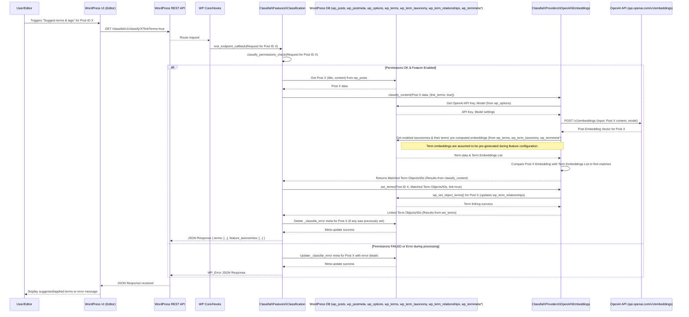

# ClassifAI Classification Feature Flow (with OpenAI Embeddings)

This diagram illustrates the sequence of operations when a user triggers the Classification feature in ClassifAI for a specific post, using OpenAI Embeddings as the provider. It shows the interaction between the WordPress application layers, the database, and the external OpenAI API to suggest and apply relevant terms.

**Key Database Interactions:**

*   **`wp_posts`**: Read post title and content for the post being classified.
*   **`wp_postmeta`**:
    *   Read `_classifai_process_content` (not shown in this specific flow but relevant for auto-classification on save).
    *   Store or delete `_classifai_error` meta if classification fails or succeeds.
*   **`wp_options`**: Stores ClassifAI plugin settings, including feature enablement, selected provider (OpenAI Embeddings), OpenAI API key, and the embedding model to be used.
*   **`wp_terms`**, **`wp_term_taxonomy`**: Read existing term data (name, slug, description) for enabled taxonomies.
*   **`wp_termmeta`***: Assumed to store pre-computed embeddings for existing terms. These embeddings are generated during the initial feature configuration when term data is sent to the provider. (The exact storage mechanism within the WP database for term embeddings might vary if not using a solution like ElasticPress for this).
*   **`wp_term_relationships`**: Stores the associations between the post and the terms that are applied as a result of classification.

**WordPress REST API Endpoint:**

*   **Endpoint:** `GET /classifai/v1/classify/{post_id}`
*   **Purpose:** Triggers the classification process for a given post ID using the configured AI provider (OpenAI Embeddings in this case).
*   **Handler:** `Classifai\Features\Classification::rest_endpoint_callback()`
*   **Key Parameters:**
    *   `id` (integer, required): The ID of the post to classify.
    *   `linkTerms` (boolean, optional, default: `true`): If true, successfully matched terms are automatically linked to the post. If false, terms are suggested but not linked.
*   **Permissions:** Requires the user to have edit permissions for the specified post and for the taxonomies involved.
*   **Response:** JSON containing `terms` (an array of term objects or IDs that were matched/linked) and `feature_taxonomies` (an array of taxonomy slugs enabled for this feature). On error, a standard `WP_Error` JSON response is returned.

**OpenAI API Endpoint:**

*   **Endpoint:** `POST https://api.openai.com/v1/embeddings`
*   **Purpose:** Generates a vector representation (embedding) for the input text. This embedding is then used by the plugin to find semantically similar terms.
*   **Key Request Data:**
    *   `input` (string or array): The text content of the post.
    *   `model` (string): The specific OpenAI embedding model to use (e.g., `text-embedding-3-small`, `text-embedding-ada-002`).
*   **Authentication:** Via an API Key included in the request headers.
*   **Response:** JSON object containing the embedding vector(s) for the input text.
