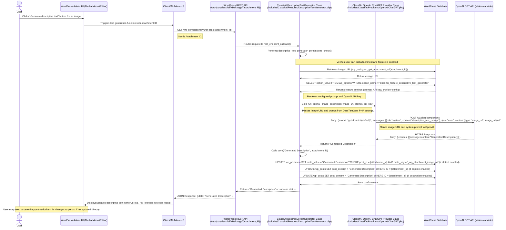

# ClassifAI Descriptive Text Generator Data Flow (with OpenAI)

This diagram outlines the sequence of events when a user generates descriptive text (alt text, caption, or description) for an image using ClassifAI's Descriptive Text Generator feature, with OpenAI as the configured AI provider. This flow typically initiates from the Media Modal or the attachment edit screen.

## Automatic Generation on Upload

It's worth noting that descriptive text can also be generated automatically when an image is uploaded.
1.  User uploads an image.
2.  WordPress core triggers the `wp_generate_attachment_metadata` hook.
3.  `DescriptiveTextGenerator::generate_image_alt_tags()` is called.
4.  This method internally calls the provider (similar to the manual flow above) to get the description.
5.  The description is then saved to the configured fields (alt, caption, description) in the `wp_postmeta` and `wp_posts` tables.

## Layers Involved

*   **WordPress Application Layer**:
    *   `User`: The end-user interacting with the WordPress Media Library or editor.
    *   `WordPress Admin UI (Media Modal/Editor)`: The interface for managing media.
    *   `ClassifAI Admin JS`: JavaScript handling client-side interaction for text generation.
    *   `WordPress REST API`: The `/wp-json/` interface, including ClassifAI's custom endpoint.
    *   `ClassifAI DescriptiveTextGenerator Class (DescTextGen_PHP)`: The PHP class (`DescriptiveTextGenerator.php`) containing the server-side logic for this feature.
    *   `ClassifAI OpenAI ChatGPT Provider Class (ChatGPT_Provider_PHP)`: The PHP class responsible for communicating with the OpenAI API.
*   **Database Layer**:
    *   `WordPress Database (WP_DB)`:
        *   `wp_posts`: Stores image captions (in `post_excerpt`) and descriptions (in `post_content`).
        *   `wp_postmeta`: Stores image alt text (in `_wp_attachment_image_alt`).
        *   `wp_options`: Stores ClassifAI plugin settings, including the descriptive text generation prompt and OpenAI API key (e.g., under `classifai_feature_descriptive_text_generator` option).
*   **API Layer**:
    *   `WordPress REST API` (Internal): Endpoint `/wp-json/classifai/v1/alt-tags/{attachment_id}`.
    *   `OpenAI GPT API` (External): The AI service endpoint (e.g., GPT-4 Vision).
*   **AI Provider**:
    *   `OpenAI GPT API`: The specific AI model service used for generating image descriptions.

## Data Flow Summary

1.  **User Action**: The user initiates descriptive text generation for an image via the WordPress Admin UI (e.g., Media Modal).
2.  **Client-Side Request**: JavaScript makes a GET request to a ClassifAI REST API endpoint, passing the attachment ID.
3.  **Server-Side Processing (ClassifAI - DescriptiveTextGenerator)**:
    *   The `DescriptiveTextGenerator.php` class handles the request.
    *   It performs permission checks.
    *   It retrieves the image URL.
    *   It fetches the configured prompt (default: "You are an assistant that generates descriptions of images...") and OpenAI API key from `wp_options`.
4.  **AI Provider Request (ClassifAI - ChatGPT_Provider_PHP)**:
    *   The `ChatGPT.php` provider class receives the image URL and prompt.
    *   It sends the image URL and the prompt to the OpenAI GPT API (a vision-capable model).
5.  **AI Provider Response**: OpenAI processes the request and returns a generated description.
6.  **Server-Side Response & Save (ClassifAI - DescriptiveTextGenerator)**:
    *   The generated description is received.
    *   The `save()` method updates the relevant WordPress fields (`_wp_attachment_image_alt` in `wp_postmeta`, `post_excerpt`, or `post_content` in `wp_posts`) based on plugin settings.
    *   The ClassifAI REST endpoint sends the generated description back to the client.
7.  **Client-Side Display**: JavaScript displays the generated text in the appropriate field in the Media Modal or editor UI.
8.  **Automatic Flow**: Alternatively, on image upload, the `wp_generate_attachment_metadata` hook triggers a similar server-side flow to automatically generate and save descriptive text.
