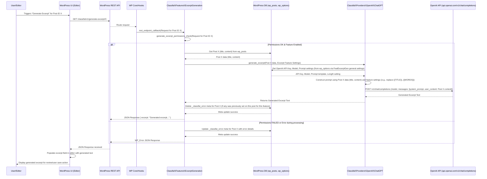

# ClassifAI Excerpt Generation Feature Flow (with OpenAI ChatGPT)

This diagram illustrates the sequence of operations when a user triggers the Excerpt Generation feature in ClassifAI for a specific post, using OpenAI ChatGPT as the provider. It shows the interaction between the WordPress application layers, the database, and the external OpenAI API to generate an excerpt.

**Key Database Interactions:**

*   **`wp_posts`**:
    *   Read post title and content for the post requiring an excerpt.
    *   The generated excerpt is typically updated in this table by the editor upon user save, not directly by this backend flow.
*   **`wp_postmeta`**:
    *   Store or delete `_classifai_error` meta if excerpt generation fails or succeeds for a specific post and feature.
*   **`wp_options`**: Stores ClassifAI plugin settings, including:
    *   Feature enablement for Excerpt Generation.
    *   Selected provider (OpenAI ChatGPT).
    *   OpenAI API key.
    *   Default and custom prompts for excerpt generation.
    *   Desired excerpt length.
    *   Model selection for the OpenAI provider.

**WordPress REST API Endpoint:**

*   **Endpoint:** `GET /classifai/v1/generate-excerpt/{post_id}` (also supports `POST /classifai/v1/generate-excerpt` for content not tied to a post ID)
*   **Purpose:** Triggers the excerpt generation process for a given post ID (or provided content) using the configured AI provider (OpenAI ChatGPT in this case).
*   **Handler:** `Classifai\Features\ExcerptGeneration::rest_endpoint_callback()`
*   **Key Parameters (for GET):**
    *   `id` (integer, required): The ID of the post to generate an excerpt for.
*   **Permissions:** Requires the user to have edit permissions for the specified post (if ID is provided) and for the Excerpt Generation feature to be enabled for their role/user.
*   **Response:** JSON containing `excerpt` (the generated text). On error, a standard `WP_Error` JSON response is returned.

**OpenAI API Endpoint:**

*   **Endpoint:** `POST https://api.openai.com/v1/chat/completions`
*   **Purpose:** Generates text completions based on a conversational prompt. For excerpt generation, this involves sending the post content and a directive to summarize it.
*   **Key Request Data (simplified):**
    *   `model` (string): The specific OpenAI model to use (e.g., `gpt-3.5-turbo`, `gpt-4`).
    *   `messages` (array): An array of message objects, typically including:
        *   A system message defining the AI's task (e.g., the customized excerpt prompt).
        *   A user message containing the post content to be summarized.
*   **Authentication:** Via an API Key included in the request headers.
*   **Response:** JSON object containing the generated text (the excerpt) among other details.
