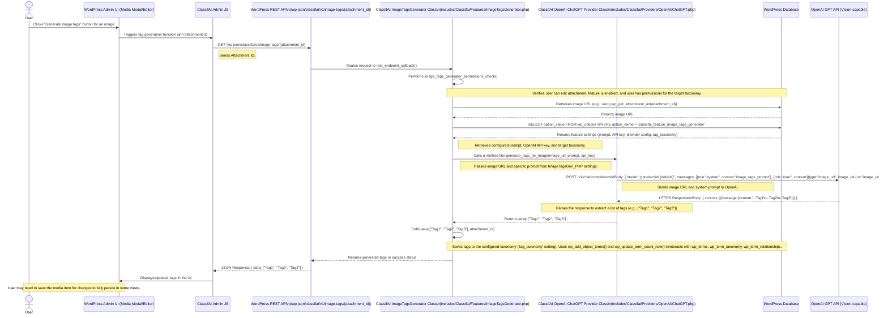

# ClassifAI Image Tags Generator Data Flow (with OpenAI)

This diagram outlines the sequence of events when a user generates tags for an image using ClassifAI's Image Tags Generator feature, with OpenAI (ChatGPT with Vision) as the configured AI provider. This flow can be initiated manually from the Media Modal or attachment edit screen, or automatically upon image upload.

## Automatic Generation on Upload

Image tags can also be generated automatically when an image is uploaded:
1.  User uploads an image.
2.  WordPress core triggers the `wp_generate_attachment_metadata` hook.
3.  `ImageTagsGenerator::generate_image_tags()` is called.
4.  This method internally calls its `run()` method (which then calls the `ChatGPT_Provider_PHP` similar to the manual flow) to get the tags.
5.  The tags are then saved using the `save()` method to the configured taxonomy.

## Layers Involved

*   **WordPress Application Layer**:
    *   `User`: The end-user interacting with the WordPress Media Library or editor.
    *   `WordPress Admin UI (Media Modal/Editor)`: The interface for managing media.
    *   `ClassifAI Admin JS`: JavaScript handling client-side interaction for tag generation.
    *   `WordPress REST API`: The `/wp-json/` interface, including ClassifAI's custom endpoint.
    *   `ClassifAI ImageTagsGenerator Class (ImageTagsGen_PHP)`: The PHP class (`ImageTagsGenerator.php`) containing the server-side logic for this feature.
    *   `ClassifAI OpenAI ChatGPT Provider Class (ChatGPT_Provider_PHP)`: The PHP class (`ChatGPT.php`) responsible for communicating with the OpenAI API.
*   **Database Layer**:
    *   `WordPress Database (WP_DB)`:
        *   `wp_posts`: Stores attachment details (post_type 'attachment').
        *   `wp_postmeta`: May store other metadata related to attachments.
        *   `wp_options`: Stores ClassifAI plugin settings, including the image tags generation prompt, OpenAI API key, and the target taxonomy (e.g., under `classifai_feature_image_tags_generator` option).
        *   `wp_terms`: Stores the individual tag names.
        *   `wp_term_taxonomy`: Links terms to taxonomies (e.g., 'classifai-image-tags' or a user-defined taxonomy), stores term descriptions and counts.
        *   `wp_term_relationships`: Associates attachments (object_id) with term_taxonomy_ids.
*   **API Layer**:
    *   `WordPress REST API` (Internal): Endpoint `/wp-json/classifai/v1/image-tags/{attachment_id}`.
    *   `OpenAI GPT API` (External): The AI service endpoint (e.g., GPT-4 Vision).
*   **AI Provider**:
    *   `OpenAI GPT API`: The specific AI model service (e.g., a vision-capable GPT model) used for analyzing the image and generating relevant tags based on the provided prompt.

## Data Flow Summary

1.  **User Action (Manual)**: The user initiates image tag generation for an image via the WordPress Admin UI (e.g., Media Modal by clicking "Generate image tags").
2.  **Client-Side Request**: JavaScript makes a GET request to the ClassifAI REST API endpoint `/wp-json/classifai/v1/image-tags/{attachment_id}`, passing the attachment ID.
3.  **Server-Side Processing (ClassifAI - ImageTagsGenerator)**:
    *   The `ImageTagsGenerator.php` class handles the request.
    *   It performs permission checks (user capability, feature enabled, taxonomy permissions).
    *   It retrieves the image URL using `wp_get_attachment_url()`.
    *   It fetches the configured prompt, OpenAI API key, and target taxonomy from `wp_options` (via `classifai_feature_image_tags_generator` setting).
4.  **AI Provider Request (ClassifAI - ChatGPT_Provider_PHP)**:
    *   The `ChatGPT.php` provider class receives the image URL and the specific prompt for generating tags.
    *   It sends the image URL and the prompt to the OpenAI GPT API (a vision-capable model like GPT-4 Vision).
5.  **AI Provider Response**: OpenAI processes the request and returns a list of suggested tags, often in a string format (e.g., hyphenated list).
6.  **Server-Side Response & Save (ClassifAI - ImageTagsGenerator)**:
    *   The provider class parses the OpenAI response into an array of tag strings.
    *   The `ImageTagsGenerator.php` class receives this array.
    *   The `save()` method is called, which uses `wp_add_object_terms()` to assign the tags to the attachment in the configured taxonomy. This updates `wp_terms`, `wp_term_taxonomy`, and `wp_term_relationships`. `wp_update_term_count_now()` is also called.
    *   The ClassifAI REST endpoint sends the generated tags (or a success message) back to the client.
7.  **Client-Side Display**: JavaScript displays the generated tags in the Media Modal or editor UI.
8.  **Automatic Flow**: Alternatively, on image upload, the `wp_generate_attachment_metadata` hook triggers a similar server-side flow: `ImageTagsGenerator::generate_image_tags()` calls `run()`, which engages the OpenAI provider to get tags, and then `save()` stores them.
