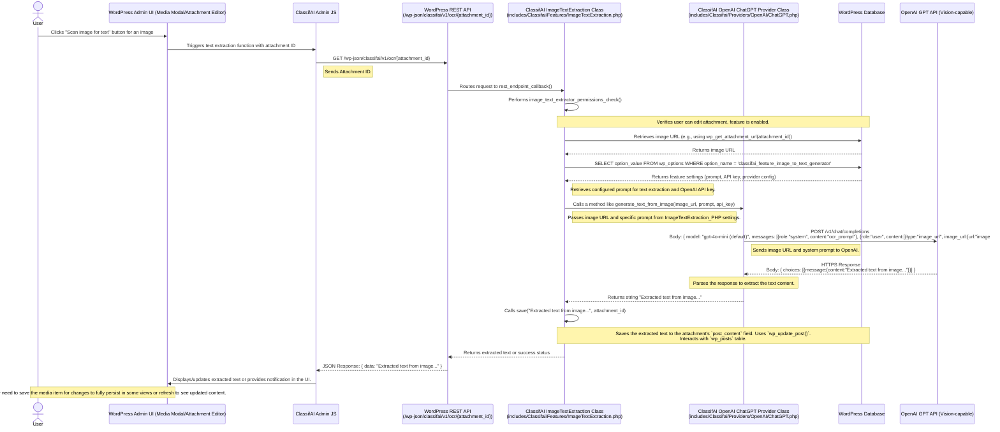

# ClassifAI Image Text Extraction Data Flow (with OpenAI)

This diagram outlines the sequence of events when ClassifAI's Image Text Extraction feature processes an image to extract text, using OpenAI (e.g., a vision-capable GPT model) as the configured AI provider. This flow can be initiated manually from the Media Modal or attachment edit screen, or automatically upon image upload.

## Automatic Generation on Upload

Text can also be extracted automatically when an image is uploaded:
1.  User uploads an image.
2.  WordPress core triggers the `wp_generate_attachment_metadata` hook.
3.  `ImageTextExtraction::generate_ocr_text()` is called.
4.  This method internally calls its `run()` method (which then calls the `ChatGPT_Provider_PHP` similar to the manual flow) to get the text.
5.  The text is then saved using the `save()` method to the attachment's `post_content`.

## Layers Involved

*   **WordPress Application Layer**:
    *   `User`: The end-user interacting with the WordPress Media Library or editor.
    *   `WordPress Admin UI (Media Modal/Attachment Editor)`: The interface for managing media.
    *   `ClassifAI Admin JS`: JavaScript handling client-side interaction for text extraction.
    *   `WordPress REST API`: The `/wp-json/` interface, including ClassifAI's custom endpoint.
    *   `ClassifAI ImageTextExtraction Class (ImageTextExtraction_PHP)`: The PHP class (`ImageTextExtraction.php`) containing the server-side logic for this feature.
    *   `ClassifAI OpenAI ChatGPT Provider Class (ChatGPT_Provider_PHP)`: The PHP class (`ChatGPT.php`) responsible for communicating with the OpenAI API.
*   **Database Layer**:
    *   `WordPress Database (WP_DB)`:
        *   `wp_posts`: Stores attachment details (post_type 'attachment') and the extracted text in the `post_content` field of the attachment.
        *   `wp_options`: Stores ClassifAI plugin settings, including the image text extraction prompt and OpenAI API key (e.g., under `classifai_feature_image_to_text_generator` option).
*   **API Layer**:
    *   `WordPress REST API` (Internal): Endpoint `/wp-json/classifai/v1/ocr/{attachment_id}`.
    *   `OpenAI GPT API` (External): The AI service endpoint (e.g., GPT-4 Vision).
*   **AI Provider**:
    *   `OpenAI GPT API`: The specific AI model service (e.g., a vision-capable GPT model) used for analyzing the image and extracting text based on the provided prompt.

## Data Flow Summary

1.  **User Action (Manual)**: The user initiates image text extraction for an image via the WordPress Admin UI (e.g., Media Modal by clicking "Scan image for text" or via the attachment edit screen).
2.  **Client-Side Request**: JavaScript makes a GET request to the ClassifAI REST API endpoint `/wp-json/classifai/v1/ocr/{attachment_id}`, passing the attachment ID.
3.  **Server-Side Processing (ClassifAI - ImageTextExtraction_PHP)**:
    *   The `ImageTextExtraction.php` class handles the request.
    *   It performs permission checks (user capability, feature enabled).
    *   It retrieves the image URL using `wp_get_attachment_url()`.
    *   It fetches the configured prompt for text extraction and OpenAI API key from `wp_options` (via `classifai_feature_image_to_text_generator` setting).
4.  **AI Provider Request (ClassifAI - ChatGPT_Provider_PHP)**:
    *   The `ChatGPT.php` provider class receives the image URL and the specific prompt for extracting text.
    *   It sends the image URL and the prompt to the OpenAI GPT API (a vision-capable model).
5.  **AI Provider Response**: OpenAI processes the request and returns the extracted text.
6.  **Server-Side Response & Save (ClassifAI - ImageTextExtraction_PHP)**:
    *   The provider class returns the extracted text string.
    *   The `ImageTextExtraction.php` class receives this string.
    *   The `save()` method is called, which uses `wp_update_post()` to save the extracted text into the `post_content` field of the attachment in the `wp_posts` table.
    *   The ClassifAI REST endpoint sends the extracted text (or a success message) back to the client.
7.  **Client-Side Display**: JavaScript displays a notification or the extracted text (if applicable to the UI context).
8.  **Automatic Flow**: Alternatively, on image upload, the `wp_generate_attachment_metadata` hook triggers a similar server-side flow: `ImageTextExtraction::generate_ocr_text()` calls `run()`, which engages the OpenAI provider to get the text, and then `save()` stores it in the attachment's `post_content`.
