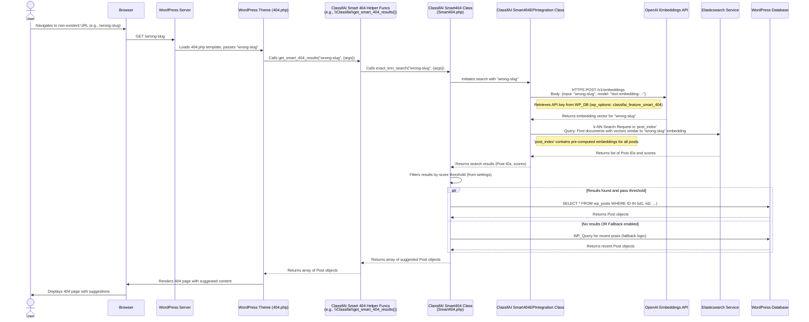

# ClassifAI Smart 404 Data Flow (with OpenAI Embeddings & Elasticsearch)

This diagram outlines the sequence of events when a user encounters a 404 page and ClassifAI's Smart 404 feature suggests relevant content. This assumes OpenAI is the configured AI provider for embeddings and ElasticPress is used for indexing and search.

**Note on Indexing:** This diagram focuses on the 404 event. A prerequisite is that site content (posts) has already been processed: their content, titles, and slugs have been converted to embeddings by OpenAI and stored in Elasticsearch by ClassifAI (typically via ElasticPress hooks on post save or bulk indexing).

## Layers Involved

*   **User Layer**:
    *   `User`: The end-user browsing the website.
    *   `Browser`: The web browser used by the user.
*   **WordPress Application Layer**:
    *   `WordPress Server`: Handles the incoming HTTP request.
    *   `WordPress Theme (404.php)`: The theme's template responsible for displaying the 404 page and invoking ClassifAI.
    *   `ClassifAI Smart 404 Helper Funcs`: Public functions provided by ClassifAI for themes to call (e.g., `\Classifai\get_smart_404_results()`).
    *   `ClassifAI Smart404 Class (Smart404.php)`: Core PHP class containing the main logic for the Smart 404 feature, including orchestrating calls to the AI provider and Elasticsearch.
    *   `ClassifAI Smart404EPIntegration Class`: PHP class responsible for the direct integration with Elasticsearch and abstracting calls to the OpenAI Embeddings API.
*   **Database Layer**:
    *   `WordPress Database (WP_DB)`:
        *   `wp_posts`: Stores all post data (ID, post_title, post_content, guid, etc.). Used to fetch full details of suggested posts.
        *   `wp_options`: Stores ClassifAI plugin settings, including the Smart 404 feature configuration, selected provider (OpenAI), and API keys (e.g., `classifai_feature_smart_404` option).
    *   `Elasticsearch Service`:
        *   `post_index` (configurable, e.g., `wp-post` via ElasticPress): Stores indexed WordPress posts, including a dedicated field for the vector embeddings of each post's content/title/slug.
*   **API Layer**:
    *   `OpenAI Embeddings API` (External): Endpoint like `https://api.openai.com/v1/embeddings`. Used to convert the 404 slug into a vector embedding.
    *   `Elasticsearch API` (Internal or External, depending on hosting): Endpoints like `http://<your-es-host>:9200/{index}/_search`. Used to perform the k-NN vector search.
*   **AI Provider**:
    *   `OpenAI Embeddings API`: The specific AI service used for generating vector embeddings.

## Data Flow Summary

1.  **Prerequisite - Content Indexing (Not shown in diagram)**:
    *   On post save/update or via WP-CLI bulk action, ClassifAI (with ElasticPress) sends post content (title, slug, main content) to the OpenAI Embeddings API.
    *   OpenAI returns vector embeddings.
    *   ClassifAI (via ElasticPress) stores these embeddings along with post data in an Elasticsearch index.

2.  **User Hits 404**: User navigates to a URL that does not exist. WordPress identifies this and loads the theme's `404.php` template.
3.  **Theme Invokes Smart 404**: The `404.php` template calls a ClassifAI helper function, passing the slug of the URL that caused the 404.
4.  **Generate Embedding for 404 Slug**:
    *   ClassifAI's `Smart404.php` logic, through `Smart404EPIntegration.php`, sends the 404 slug to the OpenAI Embeddings API.
    *   OpenAI returns a vector embedding for this slug.
5.  **Search Similar Content**:
    *   ClassifAI uses this new embedding to query the Elasticsearch index, looking for posts with the most similar pre-computed embeddings.
    *   Elasticsearch returns a list of matching post IDs and their similarity scores.
6.  **Retrieve and Process Results**:
    *   ClassifAI filters these results based on a configured score threshold.
    *   For the valid results, it fetches the full post objects (title, permalink, etc.) from the `wp_posts` table in the WordPress database.
    *   If no suitable results are found via Elasticsearch and fallback is enabled, ClassifAI queries `WP_DB` for a list of recent posts.
7.  **Display Suggestions**: The list of suggested posts is returned to the `404.php` template, which then renders them for the user.
