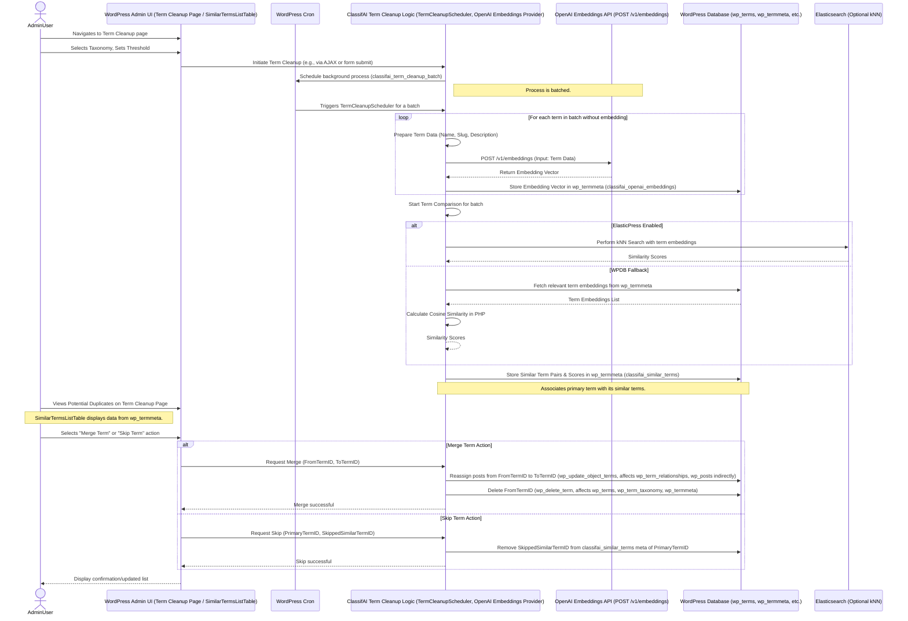

# ClassifAI Term Cleanup Feature Flow (with OpenAI)

This diagram illustrates the data and process flow for the Term Cleanup feature within ClassifAI when OpenAI Embeddings is selected as the provider.

## Flow Overview:

1.  **Initiation**:
    *   An **Admin User** navigates to the **Term Cleanup Page** (`Tools > Term Cleanup`).
    *   They select a taxonomy to process and can adjust the similarity threshold.
    *   Clicking "Find similar \[terms]" initiates the cleanup process.

2.  **Background Processing (WP Cron & `TermCleanupScheduler`)**:
    *   A background job is scheduled via WP Cron.
    *   The `TermCleanupScheduler` handles the process in batches to avoid timeouts.

3.  **Embedding Generation**:
    *   For each term in the selected taxonomy that doesn't already have an embedding stored:
        *   The term's name, slug, and description are prepared.
        *   This data is sent to the **OpenAI Embeddings API** (`/v1/embeddings`).
        *   The API returns embedding vectors for the term.
        *   These embeddings are stored in the `wp_termmeta` table, associated with the term ID (meta keys: `classifai_openai_embeddings`).

4.  **Term Comparison**:
    *   **With ElasticPress**: If ElasticPress is configured and the "Use ElasticPress" setting is enabled for Term Cleanup, the system leverages Elasticsearch's k-Nearest Neighbor (kNN) search capabilities. Term embeddings are indexed into Elasticsearch, and kNN search is used to find terms with similar embedding vectors.
    *   **Without ElasticPress (WPDB)**: If ElasticPress is not used, the embeddings for terms are fetched directly from the `wp_termmeta` table. The WordPress application layer then calculates the cosine similarity between these embedding vectors in PHP to determine how similar they are.
    *   Pairs of terms with a similarity score above the configured threshold are considered potential duplicates.

5.  **Storing Results**:
    *   The identified similar term pairs and their similarity scores are stored in the `wp_termmeta` table for the primary term (meta key: `classifai_similar_terms`).

6.  **Review and Action**:
    *   The **Term Cleanup Page** displays the potential duplicates in the `SimilarTermsListTable`.
    *   The **Admin User** can:
        *   **Merge**: If a term is merged, all posts associated with the "from" term are reassigned to the "to" term in `wp_term_relationships` (indirectly via `wp_update_object_terms` and `wp_delete_term`). The "from" term is then deleted from `wp_terms` and `wp_term_taxonomy`. Relevant meta entries in `wp_termmeta` are also cleaned up.
        *   **Skip**: If a suggestion is skipped, the corresponding entry is removed from the `classifai_similar_terms` meta field for the primary term.

## Layers Involved:

*   **WordPress Admin**: User interface for initiating and managing the term cleanup process.
*   **WordPress Application Layer (PHP)**: Handles the core logic, background processing, API communication, database interactions, and calculations (if not using ElasticPress for similarity).
    *   `TermCleanup.php`: Contains the main logic for the feature.
    *   `TermCleanupScheduler.php`: Manages the background processing.
    *   `SimilarTermsListTable.php`: Renders the table of similar terms.
    *   `OpenAI\Embeddings.php`: Handles communication with the OpenAI Embeddings API.
*   **Database Layer (MySQL)**:
    *   `wp_terms`: Stores term information (name, slug).
    *   `wp_term_taxonomy`: Stores taxonomy information for terms (taxonomy, description, count).
    *   `wp_termmeta`: Stores term metadata, including the generated embeddings and lists of similar terms.
    *   `wp_posts`: (Indirectly affected during merge) Post content.
    *   `wp_term_relationships`: (Indirectly affected during merge) Links posts to terms.
*   **API Layer**:
    *   **OpenAI Embeddings API**: External service used to generate vector representations (embeddings) of the terms.
        *   Endpoint: `https://api.openai.com/v1/embeddings` (typical base)
        *   Data Sent: Term name, slug, description.
        *   Data Received: Embedding vectors.
*   **AI Provider**:
    *   **OpenAI**: The service providing the AI model for generating embeddings.
*   **(Optional) Elasticsearch Layer**: If ElasticPress is used, it acts as an intermediary for efficient similarity searching using its kNN capabilities. Term data and their embeddings are indexed into Elasticsearch.

This flow ensures that term cleanup is efficient and leverages powerful AI capabilities to identify semantic similarities that might not be obvious through simple string matching.
