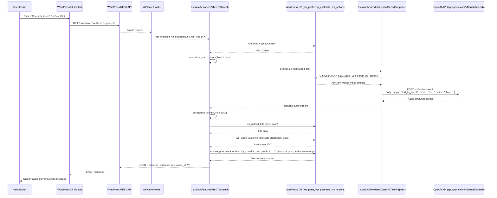

# ClassifAI Text-to-Speech Feature Flow (with OpenAI)

This diagram illustrates the sequence of operations when a user triggers the Text-to-Speech feature in ClassifAI using OpenAI as the provider. It shows the interaction between the WordPress application layers, the database, and the external OpenAI API.

**Key Database Interactions:**

*   **`wp_posts`**: Stores the original post content and details for the generated audio attachment.
*   **`wp_postmeta`**:
    *   For the original post: Stores metadata like `_classifai_post_audio_id` (ID of the audio attachment), `_classifai_post_audio_timestamp`, `_classifai_display_generated_audio` (boolean to control frontend display), `_classifai_post_audio_hash`, and `_classifai_text_to_speech_error` (if any error occurs).
    *   For the attachment: Standard WordPress attachment metadata.
*   **`wp_options`**: Stores ClassifAI plugin settings, including feature enablement, selected provider (OpenAI), OpenAI API key, and selected voice/model for Text-to-Speech.

**WordPress REST API Endpoint:**

*   **Endpoint:** `GET /classifai/v1/synthesize-speech/{post_id}`
*   **Purpose:** Triggers the speech synthesis process for a given post.
*   **Handler:** `Classifai\Features\TextToSpeech::rest_endpoint_callback()`
*   **Response:** JSON indicating success or failure, including the `audio_id` if successful.

**OpenAI API Endpoint:**

*   **Endpoint:** `POST https://api.openai.com/v1/audio/speech`
*   **Purpose:** Converts text input to audio.
*   **Key Request Data:** `model` (e.g., `tts-1`, `tts-1-hd`), `input` (the text to synthesize), `voice` (e.g., `alloy`, `nova`).
*   **Authentication:** Via API Key in request headers.
*   **Response:** Audio stream (e.g., MP3 format).
