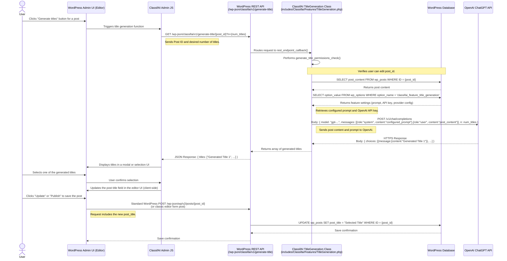

# ClassifAI Title Generation Data Flow (with OpenAI)

This diagram outlines the sequence of events when a user generates a title for a post using ClassifAI's Title Generation feature, with OpenAI as the configured AI provider.

## Layers Involved

*   **WordPress Application Layer**:
    *   `User`: The end-user interacting with the WordPress editor.
    *   `WordPress Admin UI (Editor)`: The Gutenberg or Classic editor interface.
    *   `ClassifAI Admin JS`: JavaScript handling the client-side interaction for title generation.
    *   `WordPress REST API`: The `/wp-json/` interface, including ClassifAI's custom endpoint.
    *   `ClassifAI TitleGeneration Class`: The PHP class (`TitleGeneration.php`) containing the server-side logic.
*   **Database Layer**:
    *   `WordPress Database`:
        *   `wp_posts`: Stores post content (`post_content`) and titles (`post_title`).
        *   `wp_options`: Stores ClassifAI plugin settings, including the title generation prompt and provider API keys (e.g., under `classifai_feature_title_generation` option).
*   **API Layer**:
    *   `WordPress REST API` (Internal): Endpoint `/wp-json/classifai/v1/generate-title/{post_id}`.
    *   `OpenAI ChatGPT API` (External): The AI service endpoint.
*   **AI Provider**:
    *   `OpenAI ChatGPT API`: The specific AI model service used for generating titles.

## Data Flow Summary

1.  **User Action**: The user initiates title generation from the WordPress editor for a specific post.
2.  **Client-Side Request**: JavaScript makes a GET request to a ClassifAI REST API endpoint, passing the post ID and the number of titles desired.
3.  **Server-Side Processing (ClassifAI)**:
    *   The `TitleGeneration.php` class handles the request.
    *   It performs permission checks.
    *   It fetches the post content from the `wp_posts` table.
    *   It retrieves the configured prompt and OpenAI API key from `wp_options`.
4.  **AI Provider Request**: ClassifAI sends the post content and the prompt to the OpenAI API.
5.  **AI Provider Response**: OpenAI processes the request and returns a set of generated titles.
6.  **Server-Side Response (ClassifAI)**: The ClassifAI REST endpoint sends the generated titles back to the client.
7.  **Client-Side Display**: JavaScript displays the suggested titles to the user in the editor.
8.  **User Selection & Save**:
    *   The user selects a title.
    *   The selected title is updated in the editor's title field.
    *   When the user saves the post, the standard WordPress save mechanism updates the `post_title` in the `wp_posts` table.
